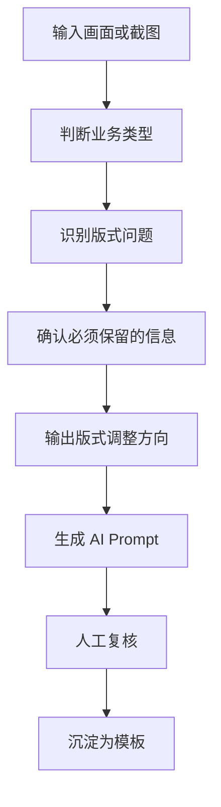

# 版式诊断与 Prompt 方案

## 项目目标

把“这张图不好看 / 不够高级 / 手机端不清楚 / 信息太乱”转化为可执行的版式调整 Prompt，帮助长发小寨在电商、社媒、包装和汇报文件中形成统一的改稿语言。

## 诊断流程



## 业务类型判断

| 类型 | 主要目标 | 重点检查 |
|---|---|---|
| 商详页 | 转化、信任、卖点理解 | 首屏是否清楚、证据是否可信、行动是否明确 |
| 店铺首页 | 品牌认知、路径引导、多 SKU 承接 | 入口是否清楚、模块是否有主次、重点 SKU 是否突出 |
| 主图 / 首图 | 点击、搜索承接 | 3 秒内是否看懂产品、功效、人群和利益点 |
| 社媒图 | 停留、收藏、转发 | 标题是否抓人、画面是否有情绪、信息是否适合平台 |
| 包装图 | 识别、系列化、货架感 | 品牌是否突出、功效是否分区、系列关系是否清楚 |
| 汇报页 | 决策、理解、推进 | 结论是否前置、结构是否可扫、数据是否清楚 |

## 常见版式问题

| 问题 | 表现 | 调整方向 |
|---|---|---|
| 信息层级乱 | 标题、卖点、证据、行动都在抢注意力 | 建立主标题、次信息、辅助信息三级结构 |
| 重点不突出 | 看完不知道最重要卖点是什么 | 首屏只保留一个主利益点，其他信息下沉 |
| 画面太满 | 字多、元素多、留白不足 | 压缩文字、分组信息、增加呼吸感 |
| 手机端不友好 | 字太小、细节太密、长图节奏乱 | 按手机一屏一个信息重排 |
| 风格不统一 | 字体、颜色、图形、图片质感不一致 | 统一品牌色、字体层级、图片风格 |
| 转化行动弱 | 不知道下一步点哪里、买什么 | 增加明确 CTA、权益、规格选择提示 |
| 证据不可信 | 数据堆叠但没有解释 | 把证据转成用户能懂的结果表达 |

## Prompt 输出结构

每条版式调整 Prompt 都应包含 8 个部分：

| 部分 | 内容 |
|---|---|
| 任务目标 | 要解决什么问题，例如“提升商详首屏手机端理解效率” |
| 画面对象 | 商详页、首页、主图、海报、包装、汇报页等 |
| 使用场景 | 淘宝手机端、小红书、抖音封面、包装打样、老板汇报等 |
| 必须保留 | 品牌名、产品图、核心卖点、价格、证据、二维码等 |
| 重点调整 | 层级、留白、对齐、模块顺序、图片比例、文字压缩 |
| 风格要求 | 高级感、东方植萃、专业功效、清爽轻盈、品牌统一 |
| 禁止事项 | 不要改品牌名、不要新增未经确认功效、不要遮挡产品 |
| 交付格式 | 输出几版、比例、尺寸、是否需要对比说明 |

## 通用 Prompt 模板

```text
请基于我提供的画面，帮我做一次版式调整方案。

业务类型：{商详页/首页/主图/社媒图/包装/汇报页}
使用场景：{淘宝手机端/小红书/抖音/包装打样/老板汇报}
核心目标：{提升理解效率/突出主卖点/增强高级感/提高转化/统一品牌风格}

必须保留：
1. {品牌名/产品图/核心文案/价格/活动/二维码/数据}
2. {不能删改的信息}

重点调整：
1. 重新建立信息层级，主标题第一眼可读。
2. 压缩次要文字，避免手机端信息过密。
3. 增加留白和模块分组，让画面更可扫。
4. 产品图和核心卖点要形成清晰视觉焦点。
5. 风格保持长发小寨的东方植萃、高级、可信、清爽。

禁止：
1. 不要改品牌名、产品名和已确认功效。
2. 不要新增未经证实的数据或医疗化表达。
3. 不要让文字遮挡产品主体。
4. 不要使用过度花哨、廉价促销感的版式。

请输出：
1. 版式问题诊断。
2. 调整后的版式结构。
3. 可直接给设计师执行的改稿说明。
4. 可直接给 AI 改图工具使用的 Prompt。
```

## 第一轮优先应用

| 优先级 | 应用对象 | 原因 |
|---:|---|---|
| 1 | AI项目01 的高级感商详页 | 直接影响淘内转化，需要手机端清晰 |
| 2 | AI项目01 的明星版本首页 | 直接影响品牌第一印象和店铺路径 |
| 3 | 主图 / 首图 | 影响搜索点击和内容回流 |
| 4 | 小红书长图 | 影响站外种草与收藏 |
| 5 | 包装正面 | 影响系列化识别和品牌资产 |

## 输出判断标准

好的版式调整 Prompt，必须让执行人看完就知道：

- 哪些内容不能动。
- 哪个信息要最大。
- 哪些内容要下沉或删减。
- 手机端第一屏要看见什么。
- 画面应该更像“高级品牌”还是“强转化页面”。
- 改完后如何判断是否更好。
