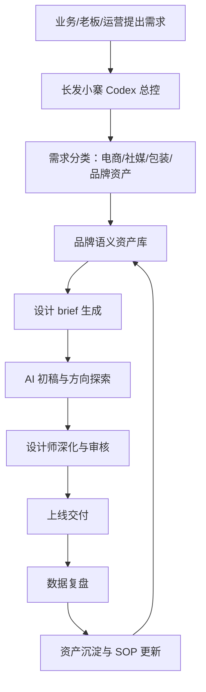
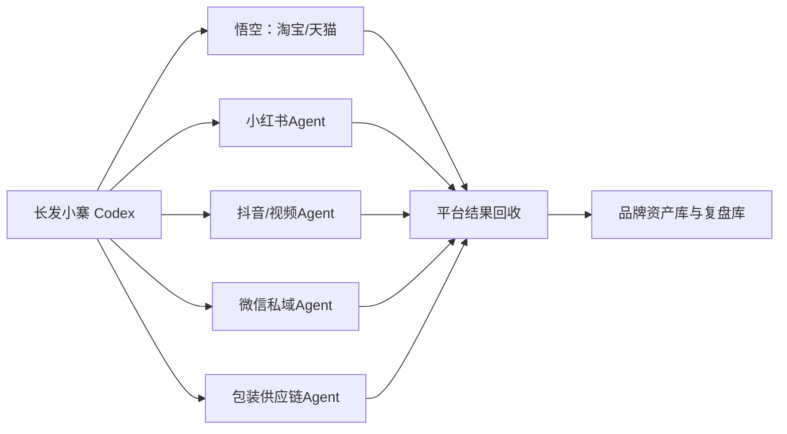

# 长发小寨品牌设计部 AI 战略汇报

## 一句话结论

长发小寨不应该只把 AI 当作“帮设计师出图、帮运营写文案”的工具，而应该把 AI 建成品牌设计部的经营中枢：用 Codex 做总控，用 Jessie Skill 做电商增长 SOP，用外部 AI 做图文视频生产，用品牌资料库沉淀设计资产，最终让品牌设计部从“接需求的执行部门”升级为“品牌资产、内容资产、转化资产的中台”。

## 为什么现在要做

品牌设计部的工作已经不只是做图。今天的品牌设计同时影响三件事：

1. 用户是否看懂品牌。
2. 内容是否能被平台和 AI 推荐。
3. 流量进入店铺后是否能成交和复购。

如果电商设计、包装设计、社媒推广各做各的，就会出现典型断点：包装说一套、详情页说一套、社媒内容说一套、投放素材又说一套。用户心智无法沉淀，搜索词无法统一，内容流量无法回流，设计工作也无法沉淀为长期资产。

## 当前已有基础

项目里已经整理出一套可作为底座的 AI 能力库：

- 35 个 Jessie Skill，覆盖诊断、洞察、内容、搜索、承接、复盘、团队推进。
- 长发小寨 Codex 总控 Skill，用于判断任务类型并调度对应 Skill。
- Skill 路由表，用于把业务问题映射到具体 SOP。
- 外部 AI 调度原则，用于区分 Codex、千问/豆包、生图视频工具、阿里生态数据的边界。

这些能力原本偏电商内容流量，现在可以扩展为品牌设计部全流程系统。

## 对悟空的定位

悟空是阿里生态产物，更适合定位为淘宝/天猫专项 Agent。它可以帮助长发小寨处理淘内搜索、店铺承接、商品页优化、投放和成交复盘，但不适合作为全品牌总控。

长发小寨自己的 Codex 必须站在更高一层：它要同时看淘宝、社媒、包装、私域、供应链、品牌资产和团队执行。未来还会出现更多类似悟空的 Agent，长发小寨 Codex 的价值就是把这些 Agent 纳入统一调度，而不是被某一个平台 Agent 牵着走。

## 品牌设计部 AI 中枢的目标

### 目标一：统一品牌表达

把品牌定位、产品卖点、用户痛点、场景词、搜索词、包装语言、详情页语言、社媒语言统一到一套语义资产里。

### 目标二：统一设计流程

把设计需求从“谁急谁先做”变成标准流程：需求 brief、资料检查、AI 初稿、设计深化、审核、上线、复盘、资产沉淀。

### 目标三：统一增长链路

让设计不只看美观，还要服务链路：社媒种草、电商搜索、详情页承接、投放放大、复购沉淀。

### 目标四：统一资产沉淀

每一次包装、详情页、短视频、海报、社媒图、投放素材，都要沉淀成可复用的品牌视觉资产、内容资产、关键词资产和转化资产。

## 设计部覆盖范围

| 板块 | 核心任务 | AI 可辅助内容 | 关键输出 |
|---|---|---|---|
| 电商设计 | 主图、详情页、活动页、店铺首页、投放素材 | 卖点拆解、详情页结构、视觉方向、转化检查 | 商品页设计 brief、详情页结构、素材分级表 |
| 品牌社媒推广 | 小红书、抖音、视频号、公众号、私域海报 | 内容选题、脚本、图文结构、平台适配 | 内容日历、社媒视觉模板、笔记/短视频脚本 |
| 包装设计 | 包装策略、包装视觉、结构配合、打样上市 | 商品语义、货架识别、包装卖点、系列化规则 | 包装设计 brief、包装视觉规范、上市联动清单 |
| 品牌资产管理 | VI、字体、色彩、版式、图片、视频、案例 | 资产归类、语义标签、复用建议 | 品牌资产库、设计规范、复用索引 |
| 数据复盘 | 内容、电商、投放、转化、复购数据 | 异常诊断、素材评分、下一轮优化 | 周度/月度设计复盘表 |

## 推荐架构

外部 Agent 关系：

## 分阶段落地路线

### 第一阶段：2 周内，搭底座

- 整理品牌基础资料、现有 SKU、包装、店铺、社媒内容。
- 建立品牌语义资产表。
- 建立电商、社媒、包装三类设计 brief 模板。
- 选 1 个 SKU 做全链路试跑。

### 第二阶段：30 天内，跑通三条线

- 电商线：完成核心 SKU 详情页/主图/投放素材 SOP。
- 社媒线：完成 1 个月内容日历和图文/短视频模板。
- 包装线：完成包装设计需求、打样、上市联动 SOP。
- 建立周度复盘机制。

### 第三阶段：60 天内，形成部门机制

- 建立品牌设计部 AI 工作台。
- 形成素材评分和复用机制。
- 建立跨部门需求入口和审核机制。
- 把高频流程做成可重复调用的 Skill 或模板。

### 第四阶段：90 天内，进入资产化运营

- 形成品牌视觉资产库、关键词资产库、包装资产库、内容资产库。
- 用数据反向指导下一轮设计。
- 让设计部成为品牌增长链路里的中台部门。

## 需要老板拍板的事项

1. 品牌设计部是否升级为“品牌资产与增长设计中台”。
2. 是否指定一位 AI 设计流程负责人，负责推进 SOP 和资料沉淀。
3. 是否先选一个核心 SKU 做电商、社媒、包装联动试点。
4. 是否统一要求所有设计需求必须带 brief、上线目标和复盘口径。

## 汇报口径

这件事不是为了让 AI 替代设计师，而是让设计师不再从空白开始，不再重复做低价值执行，不再只对审美负责，而是对品牌一致性、内容回流、店铺承接和资产沉淀负责。
