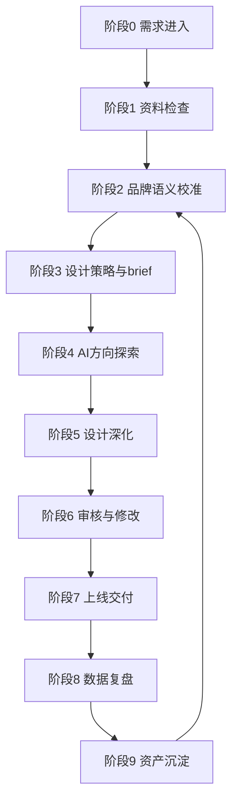

# 品牌设计全流程 SOP 总纲

## 总流程

## 阶段 0：需求进入

目标：把模糊需求变成可判断、可排期、可交付的设计任务。

必须明确：

- 这次设计服务什么业务目标。
- 属于电商设计、社媒推广、包装设计还是品牌资产建设。
- 是否绑定具体 SKU、活动、渠道或上市节点。
- 谁拍板、谁使用、谁提供数据。

输出：《设计需求登记表》

## 阶段 1：资料检查

目标：判断资料是否足够开始设计，避免设计师凭感觉补业务信息。

检查项：

- 品牌资料：定位、VI、调性、禁用规则。
- 产品资料：SKU、卖点、成分/材质、价格、目标人群。
- 渠道资料：平台、尺寸、投放规则、上线时间。
- 经营资料：搜索词、转化问题、内容表现、竞品样本。
- 参考资料：历史设计、包装、详情页、社媒内容。

输出：《资料完整度检查表》

## 阶段 2：品牌语义校准

目标：先统一“说什么”，再决定“怎么设计”。

校准内容：

- 品牌核心表达。
- 产品购买理由。
- 用户痛点与使用场景。
- 搜索词、卖点词、场景词。
- 信任证据：资质、评价、数据、达人背书、实验/工艺证明。

可调用 Skill：

- `brand-semantic-asset-sop`
- `ai-product-semantic-reconstruction`
- `keyword-unified-sop`
- `ai-trust-evidence-chain`

输出：《品牌/产品语义资产表》

## 阶段 3：设计策略与 brief

目标：把业务目标翻译成设计任务书。

设计 brief 必须包含：

- 项目背景。
- 目标人群。
- 使用渠道。
- 核心信息层级。
- 视觉方向。
- 必须出现的信息。
- 禁止事项。
- 交付规格。
- 审核人和时间。
- 复盘指标。

输出：《设计 brief》

## 阶段 4：AI 方向探索

目标：用 AI 快速探索方向，但不直接把 AI 图当最终交付。

AI 可用于：

- 视觉风格探索。
- 竞品结构拆解。
- 卖点表达扩写。
- 详情页结构建议。
- 社媒内容选题。
- 包装货架识别模拟。
- 多版本文案与画面方向。

输出：《方向探索稿》《AI 生成记录》

## 阶段 5：设计深化

目标：设计师基于已确认方向，完成正式设计。

深化内容：

- 版式、字体、色彩、图片、图形、信息层级。
- 系列化统一。
- 渠道适配。
- 转化路径和行动提示。
- 印刷、打样或上线规格。

输出：《设计初稿》

## 阶段 6：审核与修改

目标：用统一标准审核，减少纯主观修改。

审核维度：

- 品牌一致性。
- 信息准确性。
- 渠道适配性。
- 转化承接性。
- 合规与风险。
- 可复用性。

输出：《修改记录》《终稿确认》

## 阶段 7：上线交付

目标：确保设计不是只交文件，而是完成渠道上线和使用交接。

交付内容：

- 源文件。
- 导出文件。
- 尺寸规格。
- 使用说明。
- 上线位置。
- 负责人。
- 上线时间。

输出：《上线交付清单》

## 阶段 8：数据复盘

目标：判断设计是否帮助业务结果改善。

不同设计看不同指标：

| 类型 | 核心指标 |
|---|---|
| 电商设计 | 点击率、收藏加购、转化率、跳失率、ROI、搜索进店 |
| 社媒推广 | 完播率、互动率、收藏率、评论关键词、搜索回流 |
| 包装设计 | 货架识别、用户反馈、开箱传播、复购评价、渠道反馈 |
| 投放素材 | 点击率、转化率、搜索回流、复用价值、素材衰减速度 |

输出：《设计复盘表》

## 阶段 9：资产沉淀

目标：每次设计都沉淀为下一次可复用资产。

沉淀内容：

- 视觉资产：模板、配色、版式、图片、插画、图标。
- 语义资产：卖点、关键词、场景词、问答语料。
- 内容资产：脚本、笔记、海报、短视频结构。
- 转化资产：高转化详情页结构、高效投放素材。
- 包装资产：系列规范、材质工艺、打样经验。

输出：《品牌设计资产库更新记录》

## 三条业务线执行关系

| 业务线 | 起点 | 重点 | 终点 |
|---|---|---|---|
| 电商设计 | 商品/活动需求 | 转化承接 | 页面上线与转化复盘 |
| 社媒推广 | 内容/传播需求 | 种草与回流 | 内容发布与互动复盘 |
| 包装设计 | 产品/上市需求 | 识别与信任 | 打样量产与上市联动 |

## 总 SOP 的关键原则

1. 没有 brief，不进入正式设计。
2. 没有语义校准，不直接做视觉。
3. 没有渠道目标，不判断设计好坏。
4. 没有复盘，不算项目结束。
5. 没有沉淀，不算真正完成。
