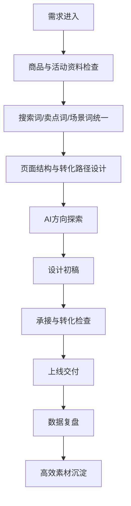

# 电商设计 SOP

## 适用范围

适用于淘宝/天猫店铺首页、商品主图、详情页、活动页、直播间物料、投放素材、超级短视频封面、客服承接图、私域转化图等电商场景。

## 核心目标

电商设计不是单纯做“好看的页面”，而是让用户从内容、搜索、广告、活动进入店铺后，能在最短时间内看懂购买理由、建立信任、完成下一步动作。

## 标准流程

## 阶段 1：需求进入

必须明确：

- 设计类型：主图、详情页、店铺首页、活动页、投放素材、直播物料。
- 核心 SKU 或活动。
- 本次目标：提升点击、提升转化、承接种草、活动爆发、老客复购。
- 上线时间。
- 复盘指标。

输出：《电商设计需求登记表》

## 阶段 2：商品与活动资料检查

必须收集：

- 商品基础信息：品名、规格、价格、功效/功能、材质/成分。
- 核心卖点：主卖点、辅助卖点、差异点。
- 用户痛点：用户为什么需要它。
- 信任证据：评价、资质、工艺、数据、达人背书、销量。
- 活动信息：优惠、赠品、机制、时间。
- 历史数据：点击率、转化率、收藏加购、跳失率、投放 ROI。

输出：《电商设计资料完整度检查表》

## 阶段 3：关键词与卖点统一

电商设计前必须统一三类词：

| 类型 | 说明 | 应用位置 |
|---|---|---|
| 搜索词 | 用户会搜什么 | 标题、主图、详情页、投放关键词 |
| 卖点词 | 用户为什么买 | 首屏、卖点模块、利益点文案 |
| 场景词 | 用户在什么情况下用 | 使用场景图、社媒内容、详情页场景模块 |

可调用 Skill：

- `keyword-unified-sop`
- `ai-product-semantic-reconstruction`
- `ai-content-search-connect`

输出：《商品关键词与卖点统一表》

## 阶段 4：页面结构与转化路径设计

### 主图结构

1. 第一张：核心购买理由。
2. 第二张：核心卖点或场景。
3. 第三张：信任证据。
4. 第四张：规格/适用人群。
5. 第五张：活动利益点或对比优势。

### 详情页结构

1. 首屏：一句话购买理由。
2. 痛点场景：用户为什么需要。
3. 产品解决方案：产品如何解决。
4. 核心卖点：分层展开。
5. 信任证据：评价、资质、数据、工艺。
6. 使用场景：真实使用/搭配/前后对比。
7. 规格参数：明确选择。
8. 促单动作：优惠、服务、保障。

### 活动页结构

1. 活动主题。
2. 核心利益点。
3. 爆款 SKU。
4. 组合购买路径。
5. 会员/私域承接。

可调用 Skill：

- `ai-store-reception-optimization`
- `ai-content-reception-checklist`
- `ai-external-content-internal-receiving`

输出：《页面结构草图》《转化路径表》

## 阶段 5：AI 方向探索

AI 可辅助：

- 详情页模块结构。
- 商品卖点视觉化。
- 竞品页面拆解。
- 产品摄影场景提示词。
- 投放素材创意方向。
- 活动页利益点文案。

注意：AI 生成结果只用于探索，设计师必须按品牌规范和平台规范深化。

输出：《AI 方向探索记录》

## 阶段 6：设计初稿

设计师完成：

- 页面视觉方案。
- 信息层级。
- 图片/视频/图标处理。
- SKU 规格与活动信息展示。
- 移动端可读性检查。
- 多尺寸导出。

输出：《电商设计初稿》

## 阶段 7：承接与转化检查

审核问题：

1. 首屏 3 秒内能否看懂购买理由？
2. 主图与标题、搜索词是否一致？
3. 详情页是否延续社媒种草内容？
4. 卖点是否有证据支撑？
5. 活动利益点是否清晰？
6. 是否有下一步动作：购买、收藏、加购、咨询、领券？
7. 是否适配投放素材复用？

输出：《电商承接检查表》

## 阶段 8：上线交付

交付内容：

- 源文件。
- 平台尺寸图。
- 页面切图。
- 活动页素材。
- 投放素材版本。
- 上线位置和负责人。

输出：《电商设计上线清单》

## 阶段 9：数据复盘

复盘指标：

| 场景 | 指标 |
|---|---|
| 主图 | 点击率、搜索进店率 |
| 详情页 | 停留时长、跳失率、收藏加购、转化率 |
| 活动页 | 领券率、加购率、成交转化 |
| 投放素材 | 点击率、转化率、ROI、素材衰减 |
| 承接链路 | 内容到搜索、搜索到进店、进店到成交 |

可调用 Skill：

- `quality-material-screening`
- `ai-business-judgment`
- `post-promo-content-review`

输出：《电商设计复盘表》

## 阶段 10：资产沉淀

沉淀内容：

- 高点击主图结构。
- 高转化详情页模块。
- 可复用卖点表达。
- 投放有效素材。
- 活动页模板。
- 商品关键词与信任证据。

输出：《电商设计资产库更新记录》

## 电商设计禁区

- 不只追求视觉好看，忽略搜索词和购买理由。
- 不只复制竞品结构，忽略品牌差异。
- 不只看点击率，忽略进店后的承接和成交。
- 不在没有资料和 brief 的情况下直接开图。
