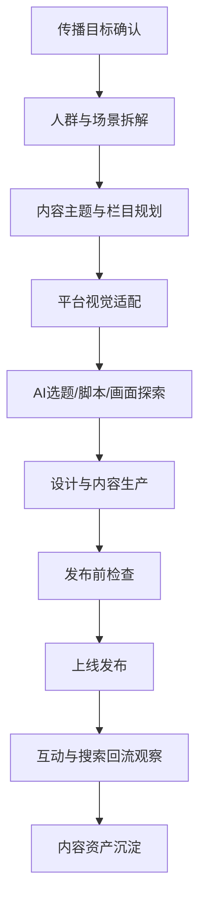

# 品牌社媒推广设计 SOP

## 适用范围

适用于小红书、抖音、视频号、公众号、微博、B站、朋友圈、社群、私域海报、达人合作素材、品牌活动传播素材等场景。

## 核心目标

品牌社媒推广设计的目标不是单条内容好看，而是持续让用户看见、理解、记住、搜索并愿意进一步了解品牌。社媒设计必须同时服务品牌心智、内容互动和电商回流。

## 标准流程

## 阶段 1：传播目标确认

必须明确：

- 这次内容为了什么：品牌认知、产品种草、活动引流、新品上市、复购召回。
- 目标平台：小红书、抖音、视频号、公众号、私域等。
- 目标人群。
- 核心 SKU 或品牌主题。
- 是否需要回流到淘宝/天猫/私域。

输出：《社媒推广需求登记表》

## 阶段 2：人群与场景拆解

拆解维度：

| 维度 | 问题 |
|---|---|
| 人群 | 谁最可能被这条内容打动？ |
| 痛点 | 他现在有什么未被解决的问题？ |
| 场景 | 他在什么情境下会想起这个产品？ |
| 触发点 | 什么标题/画面会让他停下来？ |
| 搜索动作 | 看完之后他会搜什么？ |

可调用 Skill：

- `high-value-audience-breakdown`
- `competitor-trend-insight`
- `ai-content-opportunity`

输出：《社媒人群与场景表》

## 阶段 3：内容主题与栏目规划

建议建立固定栏目，而不是每次临时想内容：

| 栏目类型 | 作用 | 示例输出 |
|---|---|---|
| 痛点共鸣 | 让用户觉得“说的是我” | 场景海报、短视频开头 |
| 产品解释 | 把卖点讲成人话 | 图文拆解、口播脚本 |
| 使用场景 | 展示真实使用方式 | 场景图、短视频分镜 |
| 信任证据 | 让用户相信 | 评价图、证据链内容 |
| 活动转化 | 引导搜索/进店/私域 | 活动图、福利海报 |
| 品牌价值 | 建立长期心智 | 品牌故事、主张海报 |

可调用 Skill：

- `win-content-design`
- `ai-content-standard-template`
- `ai-content-reference-map`

输出：《社媒栏目规划表》《月度内容日历》

## 阶段 4：平台视觉适配

不同平台的设计重点不同：

| 平台 | 视觉重点 | 内容重点 |
|---|---|---|
| 小红书 | 封面标题、生活方式感、信息密度 | 种草、经验、清单、对比 |
| 抖音 | 前 3 秒画面、人物/产品动作、字幕 | 钩子、冲突、使用场景 |
| 视频号 | 信任感、品牌感、适合转发 | 专业解释、品牌故事、用户案例 |
| 公众号 | 长图结构、版式秩序、阅读体验 | 深度内容、活动说明 |
| 私域 | 清晰利益点、行动按钮感 | 复购、福利、老客触达 |

输出：《平台视觉适配表》

## 阶段 5：AI 选题/脚本/画面探索

AI 可辅助：

- 生成选题池。
- 生成小红书标题和笔记结构。
- 生成短视频脚本和分镜。
- 生成封面文案。
- 生成画面参考提示词。
- 改写不同平台版本。

可调用 Skill：

- `xiaohongshu-note-generator`
- `short-video-script-generator`
- `private-domain-content`

输出：《AI 内容方向初稿》

## 阶段 6：设计与内容生产

设计师完成：

- 封面图。
- 信息长图。
- 短视频视觉包装。
- 字幕与版式规范。
- 社媒活动海报。
- 私域触达图。

内容团队完成：

- 标题。
- 正文。
- 口播。
- 评论区引导。
- 搜索/进店提示。

输出：《社媒内容成稿》

## 阶段 7：发布前检查

检查项：

1. 开头是否有钩子？
2. 画面是否符合品牌调性？
3. 卖点是否讲成人话？
4. 是否植入搜索词、场景词或品牌词？
5. 是否有评论区或进店引导？
6. 是否避免夸大宣传和违规表达？
7. 是否能沉淀为后续投放素材？

可调用 Skill：

- `ai-content-chain-check`
- `ai-content-reception-checklist`

输出：《社媒发布前检查表》

## 阶段 8：上线发布

交付内容：

- 平台版本文件。
- 标题和正文。
- 封面。
- 标签/话题。
- 发布时间。
- 发布人。
- 评论区引导话术。

输出：《社媒发布清单》

## 阶段 9：互动与搜索回流观察

复盘指标：

| 指标 | 看什么 |
|---|---|
| 曝光 | 内容是否被看见 |
| 完播/停留 | 内容是否抓住用户 |
| 点赞/收藏/评论 | 是否产生互动与兴趣 |
| 评论关键词 | 用户真实关心什么 |
| 品牌词/品类词搜索 | 是否带来搜索回流 |
| 进店/私域动作 | 是否进入承接链路 |

可调用 Skill：

- `ai-search-reflow-observation-sop`
- `u-shape-content-reflow`
- `quality-material-screening`

输出：《社媒内容复盘表》

## 阶段 10：内容资产沉淀

沉淀内容：

- 高互动标题。
- 高收藏图文结构。
- 高完播脚本结构。
- 用户评论问题。
- 可投放素材。
- 可回流关键词。
- 平台视觉模板。

输出：《社媒内容资产库更新记录》

## 社媒推广设计禁区

- 不只追热点，忽略品牌长期表达。
- 不只看点赞，忽略搜索回流和承接。
- 不只做单条内容，忽略栏目化和资产化。
- 不让不同平台各说各话，必须共享品牌语义资产。

