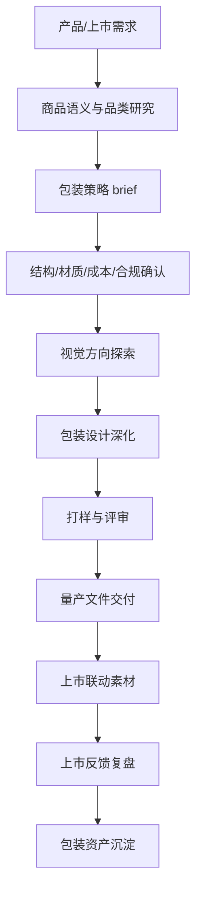

# 包装设计 SOP

## 适用范围

适用于新品包装、老品包装升级、系列包装规范、礼盒包装、活动限定包装、电商发货包装、样品装、组合装、包装上市联动素材。

## 核心目标

包装设计不只是产品外壳，而是品牌识别、购买理由、信任证据和内容传播的第一载体。好的包装要同时服务货架识别、电商展示、社媒传播、用户开箱和复购记忆。

## 标准流程

## 阶段 1：产品/上市需求确认

必须明确：

- 新品、老品升级、系列延展还是活动限定。
- 产品定位和价格带。
- 销售渠道：电商、线下、礼赠、私域、跨境。
- 上市时间。
- 成本边界。
- 包装规格和供应链限制。

输出：《包装设计需求登记表》

## 阶段 2：商品语义与品类研究

包装设计前先统一“这个产品为什么值得买”。

拆解内容：

| 维度 | 问题 |
|---|---|
| 品类识别 | 用户第一眼知道这是什么吗？ |
| 品牌识别 | 第一眼知道是谁的产品吗？ |
| 购买理由 | 包装上最该被看见的卖点是什么？ |
| 人群场景 | 谁会买、什么时候用、为什么用？ |
| 信任证据 | 有哪些资质、工艺、评价、数据可上包装或延展内容？ |
| 系列关系 | 它和其他 SKU 如何形成家族感？ |

可调用 Skill：

- `brand-semantic-asset-sop`
- `ai-product-semantic-reconstruction`
- `ai-trust-evidence-chain`

输出：《包装商品语义表》《包装信息层级表》

## 阶段 3：包装策略 brief

包装 brief 必须包含：

- 产品定位。
- 目标用户。
- 核心购买理由。
- 信息层级：品牌、品名、卖点、规格、证据、合规。
- 视觉关键词。
- 系列化规则。
- 成本与工艺限制。
- 渠道展示场景。
- 竞品参考。
- 禁止事项。

输出：《包装设计 brief》

## 阶段 4：结构/材质/成本/合规确认

包装不是纯视觉，必须先确认现实边界：

- 包装形态：盒、袋、瓶、罐、贴标、礼盒、组合装。
- 材质工艺：纸张、膜材、烫金、UV、击凸、专色等。
- 成本范围。
- 运输保护。
- 条码、生产信息、合规文案。
- 印刷文件要求。

输出：《包装技术与合规检查表》

## 阶段 5：视觉方向探索

AI 可辅助：

- 竞品包装视觉归类。
- 货架识别方向。
- 风格关键词生成。
- 系列化版式探索。
- 包装卖点表达。
- 电商首图/社媒开箱场景联想。

注意：AI 不能替代最终包装文件，尤其不能直接生成可印刷终稿。所有文字、条码、合规、尺寸、工艺必须人工确认。

输出：《包装视觉方向板》

## 阶段 6：包装设计深化

设计师完成：

- 正面主视觉。
- 侧面/背面信息。
- 系列色彩和识别系统。
- 卖点层级。
- 图形、图标、插画、摄影处理。
- 印刷工艺标注。
- 展开图文件。

输出：《包装设计初稿》

## 阶段 7：打样与评审

评审维度：

1. 远看是否能识别品牌和品类？
2. 近看是否能读懂卖点和规格？
3. 是否符合品牌调性？
4. 是否与电商详情页、社媒内容语言一致？
5. 材质工艺是否能落地？
6. 成本是否可接受？
7. 是否有合规风险？

输出：《包装打样评审表》《修改记录》

## 阶段 8：量产文件交付

交付内容：

- 包装源文件。
- 印刷展开图。
- 字体/图片/链接文件。
- 工艺说明。
- 色值说明。
- 条码和合规信息确认。
- 打样确认记录。

输出：《包装量产交付清单》

## 阶段 9：上市联动素材

包装上市不能只交给供应链，还要同步电商和社媒：

- 电商主图：包装外观与核心卖点。
- 详情页：包装升级说明、规格解释、开箱体验。
- 社媒内容：新品包装故事、开箱视频、设计理念。
- 私域内容：老客上新通知、组合购买建议。
- 投放素材：包装识别点和购买理由。

可调用 Skill：

- `ai-content-reference-map`
- `short-video-script-generator`
- `xiaohongshu-note-generator`
- `ai-store-reception-optimization`

输出：《包装上市联动清单》

## 阶段 10：上市反馈复盘

复盘指标：

| 维度 | 指标 |
|---|---|
| 货架/页面识别 | 点击率、用户第一眼反馈、客服咨询问题 |
| 内容传播 | 开箱内容互动、达人反馈、社媒评论关键词 |
| 转化 | 新品转化率、收藏加购、组合购买 |
| 供应链 | 打样次数、返工原因、量产问题 |
| 用户反馈 | 包装评价、破损率、复购评价 |

输出：《包装上市复盘表》

## 阶段 11：包装资产沉淀

沉淀内容：

- 包装系列规范。
- 信息层级模板。
- 包装卖点表达。
- 材质工艺记录。
- 打样问题库。
- 上市联动素材。
- 用户反馈和改版建议。

输出：《包装资产库更新记录》

## 包装设计禁区

- 不只做视觉风格，忽略货架和电商识别。
- 不只追求高级感，忽略用户能否看懂品类和卖点。
- 不在合规、尺寸、工艺未确认前直接定稿。
- 不让包装、电商详情页、社媒内容各说各话。
