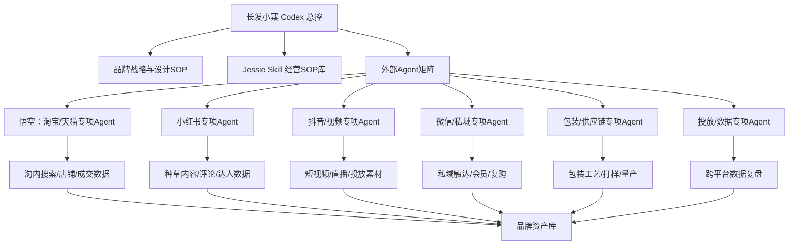

# 外部 Agent 接入与总控协议

## 核心判断

悟空这类 Agent AI 应该被视为“平台专项 Agent”，不是长发小寨的总控。悟空的优势在淘宝/天猫/阿里生态，适合处理淘内搜索、商品承接、店铺经营、投放和成交相关任务；但品牌设计部的整体经营还覆盖包装、社媒、内容、私域、供应链、品牌资产和跨平台增长，所以必须由长发小寨自己的 Codex 做总控。

## 总控关系

## 悟空的推荐定位

| 项目 | 定位 |
|---|---|
| 角色 | 淘宝/天猫生态专项 Agent |
| 适合任务 | 淘内搜索、商品标题、店铺承接、活动页、投放、成交复盘 |
| 输入 | SKU、商品页、搜索词、投放数据、活动节奏、成交数据 |
| 输出 | 淘内优化建议、承接检查、投放建议、成交复盘 |
| 不应负责 | 品牌总战略、跨平台内容判断、包装策略、社媒传播总控 |
| 管理方式 | 由长发小寨 Codex 分配任务、回收结果、统一复盘 |

## 外部 Agent 接入四问

任何新 Agent 接进来前，先回答四个问题：

1. 它服务哪个平台或业务域？
2. 它能读什么数据、能写什么结果？
3. 它的输出如何被验证？
4. 它产生的资产沉淀到哪里？

## Agent 分级

| 等级 | 类型 | 权限 |
|---|---|---|
| L1 工具型 Agent | 只生成文案、图片、脚本、提示词 | 可直接调用，但需要人工审核 |
| L2 平台型 Agent | 读取平台数据并给建议，如悟空 | 可参与判断，但不能独自拍板 |
| L3 执行型 Agent | 可改投放、改页面、改商品信息 | 必须人工确认后执行 |
| L4 总控型 Agent | 跨平台调度、拆解任务、合并判断 | 当前只保留给长发小寨 Codex |

## 接入流程

1. 登记 Agent：名称、平台、能力、账号权限、数据范围。
2. 定义边界：能做什么、不能做什么、哪些动作需要人工确认。
3. 设计输入模板：Codex 给它什么资料，它按什么格式输出。
4. 设计输出验收：Codex 用品牌一致性、链路完整性、数据可验证性审核。
5. 沉淀结果：把有效输出写回品牌资产库、内容资产库、设计资产库或数据复盘库。

## 标准任务分发模板

| 字段 | 内容 |
|---|---|
| Agent 名称 |  |
| 所属平台/业务域 |  |
| 本次任务目标 |  |
| 输入资料 |  |
| 不可越界事项 |  |
| 输出格式 |  |
| 验收标准 |  |
| 结果沉淀位置 |  |

## Codex 的总控职责

Codex 需要做四件事：

1. 分配：判断哪个 Agent 最适合处理当前任务。
2. 翻译：把品牌目标翻译成 Agent 能执行的输入。
3. 验收：检查 Agent 输出是否符合品牌、设计、平台和经营目标。
4. 沉淀：把结果变成资产，而不是停留在一次性对话。

## 风险控制

- 不让任何平台 Agent 单独决定品牌方向。
- 不让淘宝 Agent 反向绑架社媒、包装和品牌表达。
- 不让生成型 Agent 直接产出未经审核的上线素材。
- 不让数据型 Agent 只按平台指标优化，忽略品牌长期资产。
- 所有关键动作都要保留输入、输出、负责人和复盘记录。

## 未来可接入 Agent 清单

| Agent 类型 | 可能来源 | 主要用途 |
|---|---|---|
| 淘宝/天猫 Agent | 悟空、阿里系工具 | 淘内搜索、承接、投放、成交 |
| 小红书 Agent | 小红书生态工具 | 种草笔记、达人、评论洞察 |
| 抖音 Agent | 巨量/剪映/视频生成工具 | 短视频、直播、投放素材 |
| 微信私域 Agent | 企微/SCRM 工具 | 私域触达、会员、复购 |
| 包装供应链 Agent | 印刷/打样/供应链系统 | 包装工艺、成本、进度 |
| 数据复盘 Agent | BI/表格/平台数据工具 | 跨平台看板、异常诊断 |

