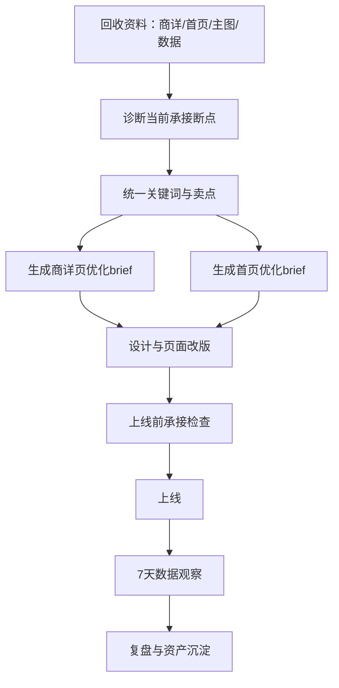

# AI 项目总台：商详页面与首页联动

## 核心结论

可以联动归总，而且必须归总。长发小寨史总汇报项目里的商详页面和首页，不应被看成两张孤立页面，而应登记为一个独立 AI 项目：

**AI项目01：淘内承接阵地优化项目**

它属于长发小寨 Codex 总控下的“淘宝/天猫专项链路”，主要负责把外部种草、搜索回流、商品卖点、活动利益点和店铺信任承接到淘宝/天猫页面中。

## 项目定位

| 项目 | 内容 |
|---|---|
| 项目编号 | AI项目01 |
| 项目名称 | 淘内承接阵地优化项目 |
| 覆盖对象 | 商详页面、店铺首页、品类页、专题页、活动页、首图、店铺导航与承接模块 |
| 所属链路 | 内容种草 -> 搜索回流 -> 店铺承接 -> 成交转化 |
| 主责部门 | 品牌设计部 / 电商运营 / 内容投放 |
| 总控角色 | 长发小寨 Codex |
| 可协同 Agent | 悟空等淘宝/天猫专项 Agent |
| 对应 SOP | 电商设计 SOP、品牌设计全流程 SOP、AI 与 Skill 调度手册 |

## 为什么商详页面和首页要作为一个 AI 项目

商详页面负责“单品成交”，首页负责“店铺信任和多品类承接”。两者如果分开做，会出现这些问题：

1. 外部内容种草说的卖点，商详页首屏没有接住。
2. 用户搜品牌或品类进店后，首页没有快速告诉他该买什么。
3. 活动页、主图、详情页、店铺首页语言不一致。
4. 投放素材带来的流量，只落到单个页面，没形成店铺内路径。
5. 复盘时只看页面好不好看，不看搜索、进店、加购、成交链路。

所以它们应该作为一个“淘内承接阵地”统一设计、统一检查、统一复盘。

## 项目目标

### 目标一：统一内容到商详的承接

让用户从小红书、抖音、视频号、达人内容、投放素材看到的卖点，在商详页首屏、主图、评价、问大家、客服话术里都能被接住。

### 目标二：统一搜索到首页的承接

让用户通过品牌词、品类词、场景词进入店铺后，首页能快速完成三件事：

1. 知道这是什么品牌。
2. 知道重点 SKU 是什么。
3. 知道下一步该点哪里、买什么、领什么权益。

### 目标三：统一页面语言和视觉资产

商详页、首页、活动页、主图、投放素材使用同一套关键词、卖点、场景、信任证据和视觉规范。

### 目标四：形成可复盘的转化阵地

每次页面更新都要能判断：点击有没有变好、跳失有没有下降、收藏加购有没有上升、转化有没有提升、搜索回流有没有被接住。

## 项目总流程

## 输入资料

| 类型 | 需要资料 | 放置建议 |
|---|---|---|
| 商详页面 | 当前详情页截图、链接、主图、首屏、评价区、问大家 | `assets/ecommerce/` |
| 店铺首页 | 首页截图、店铺导航、核心模块、活动入口 | `assets/ecommerce/` |
| 品类页 | 品类集合页、系列页、场景分类页 | `assets/ecommerce/品类页/` |
| 专题页 | 大促专题页、明星专题页、场景专题页 | `assets/ecommerce/专题页/` |
| 首图 | 搜索首图、货架图、广告首图、主图版本 | `assets/ecommerce/首图/` |
| 内容来源 | 小红书/抖音/达人/投放素材、对应卖点 | `assets/social/` |
| 搜索数据 | 品牌词、品类词、场景词、搜索进店数据 | `assets/data/` |
| 转化数据 | 点击率、跳失率、收藏加购、转化率、ROI | `assets/data/` |
| 用户反馈 | 评价、问大家、客服高频问题、社媒评论 | `assets/reviews/` |
| 品牌资料 | 品牌定位、视觉规范、核心 SKU 资料 | `assets/brand/`、`assets/sku/` |

## 可调用 Skill

| 环节 | 主 Skill | 用途 |
|---|---|---|
| 断点诊断 | `brand-content-flow-diagnosis` | 判断种草、搜索、承接、投放、复购、协同断点 |
| 内容到页面 | `ai-content-search-connect` | 建立内容-搜索-承接连接表 |
| 关键词统一 | `keyword-unified-sop` | 统一搜索词、卖点词、场景词 |
| 外种内收 | `ai-external-content-internal-receiving` | 检查站外内容到淘内页面的承接 |
| 页面优化 | `ai-store-reception-optimization` | 生成店铺/商详承接优化动作 |
| 页面检查 | `ai-content-reception-checklist` | 检查卖点一致性、搜索准备度、页面接力 |
| 素材筛选 | `quality-material-screening` | 判断哪些主图/投放素材值得放大 |
| 经营判断 | `ai-business-judgment` | 判断哪些页面动作优先做、哪些要停 |

## 与悟空的协同方式

悟空可以作为淘宝/天猫专项 Agent 参与这个项目，但不做总控。

| 任务 | 悟空可做 | Codex 要做 |
|---|---|---|
| 商品页建议 | 分析淘内商品标题、详情页、搜索承接 | 判断是否和社媒内容、包装语言一致 |
| 店铺首页建议 | 分析首页模块和淘内路径 | 判断是否形成品牌与多 SKU 承接 |
| 搜索与成交 | 看淘内搜索、转化、投放数据 | 合并外部内容、品牌资产、设计 SOP 共同判断 |
| 页面优化 | 给出淘内优化建议 | 转成设计 brief、负责人动作和复盘口径 |

## 交付物

### 老板版

- 当前淘内承接主问题。
- 商详页与首页优先级。
- 第一轮最值得改的 3-5 个动作。
- 预计影响指标。

### 团队版

- 商详页面优化 brief。
- 首页优化 brief。
- 内容-搜索-承接连接表。
- 页面上线前检查表。
- 7 天观察指标表。

### 资产版

- 高转化商详页结构。
- 首页承接模块模板。
- 关键词/卖点/场景词资产。
- 信任证据模块。
- 可复用主图/详情页/投放素材。

## 第一轮执行顺序

| 顺序 | 动作 | 负责人 | 输出 |
|---:|---|---|---|
| 1 | 回收当前商详页、首页、主图、活动页截图 | 电商运营/设计 | 页面资料包 |
| 2 | 回收最近 10 条外部种草内容和投放素材 | 内容/投放 | 内容来源表 |
| 3 | 回收搜索词、点击、转化、加购、跳失数据 | 电商/数据 | 页面数据表 |
| 4 | 诊断商详页和首页承接断点 | Codex | 断点诊断表 |
| 5 | 统一关键词、卖点、场景词 | Codex + 品牌设计部 | 三类词表 |
| 6 | 输出商详页与首页优化 brief | Codex | 设计 brief |
| 7 | 设计并上线第一轮改版 | 设计部/电商 | 上线版本 |
| 8 | 观察 7 天数据并复盘 | 电商/投放/Codex | 复盘表 |

## 7 天复盘指标

| 位置 | 指标 |
|---|---|
| 主图 | 点击率、搜索进店率 |
| 商详首屏 | 停留时长、跳失率、收藏加购 |
| 详情页中段 | 卖点模块点击、评价/问大家查看 |
| 店铺首页 | 首页点击路径、核心 SKU 点击率 |
| 活动入口 | 领券率、活动页点击率 |
| 整体转化 | 转化率、成交额、ROI |
| 搜索回流 | 品牌词/品类词/场景词变化 |

## 当前需要你补的资料

第一批只需要这些就能启动：

1. 当前店铺首页截图或链接。
2. 1-3 个核心 SKU 的商详页截图或链接。
3. 最近表现好的外部内容或投放素材。
4. 可导出的搜索词、点击、加购、转化数据。
5. 当前老板最关心的问题：点击低、转化低、跳失高、活动承接弱，还是搜索回流弱。

## 后续归总规则

以后只要是与“商详页面、首页、活动页、主图、店铺承接”相关的任务，都先归到 `AI项目01：淘内承接阵地优化项目`，再由 Codex 判断是否需要调用悟空、Jessie Skill、设计 SOP 或数据复盘工具。
