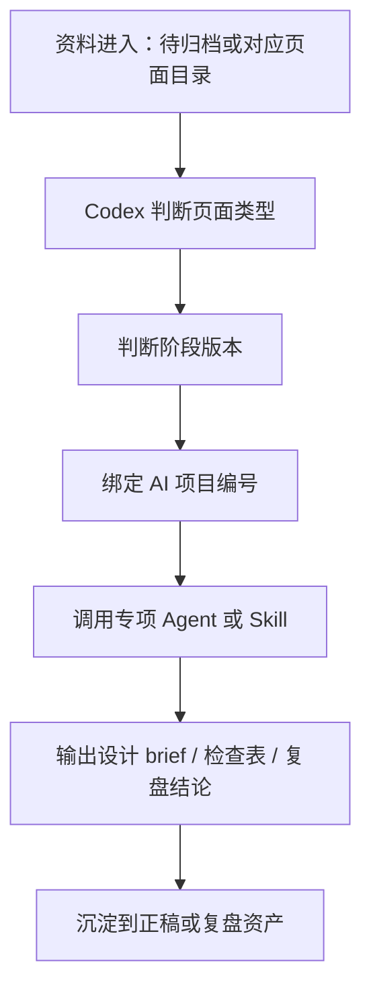

# 电商设计资产分层与版本框架

## 核心结论

电商设计资料需要分地方，但不能按个人习惯乱分。建议统一采用：

**页面类型 x 阶段版本 x AI 项目编号**

这套规则可以同时管理首页、品类页、专题页、商详页、首图、活动页、投放素材和页面数据，也能让后续悟空或其他电商专项 Agent 接入时，有明确的输入和输出位置。

## 一、页面类型分层

| 类型 | 目录 | 主要判断 |
|---|---|---|
| 首页 | `assets/ecommerce/首页/` | 品牌信任、核心 SKU 导流、店铺路径 |
| 品类页 | `assets/ecommerce/品类页/` | 多 SKU 选择、品类教育、搜索承接 |
| 专题页 | `assets/ecommerce/专题页/` | 大促、明星、场景和短期活动承接 |
| 商详页 | `assets/ecommerce/商详页/` | 单品成交、卖点表达、信任证据 |
| 首图 | `assets/ecommerce/首图/` | 点击率、搜索货架、投放第一眼 |
| 活动页 | `assets/ecommerce/活动页/` | 权益承接、活动转化、路径效率 |
| 投放素材 | `assets/ecommerce/投放素材/` | 素材点击、内容承接、投放效率 |
| 页面数据 | `assets/ecommerce/页面数据/` | 复盘、版本对比、下一轮优先级 |
| 待归档 | `assets/ecommerce/待归档/` | 临时资料先收口，再由 Codex 判断归属 |

## 二、阶段版本分层

| 阶段 | 标记 | 说明 |
|---|---|---|
| 需求资料 | `00需求` | brief、截图、参考、业务目标、数据 |
| 初稿 | `01初稿` | 第一版视觉方向和页面结构 |
| 修改稿 | `02修改稿` | 内部评审后调整 |
| 打样稿 | `03打样稿` | 准备测试、交付确认或上架前版本 |
| 输出正稿 | `04正稿` | 最终上线、交付或沉淀版本 |
| 上线复盘 | `05复盘` | 上线后数据、结论和下轮动作 |

## 三、推荐命名

```text
2026-06-AI项目01-首页-01初稿-品牌承接版.webp
2026-06-AI项目01-品类页-02修改稿-防晒系列.webp
2026-06-AI项目01-专题页-03打样稿-618承接页.webp
2026-06-AI项目01-商详页-04正稿-轻盈款核心SKU.webp
2026-06-AI项目01-首图-05复盘-点击率对比.xlsx
```

命名里至少保留四个信息：时间、AI项目编号、页面类型、阶段版本。

## 四、总控布局



## 五、和 AI项目01 的关系

当前所有电商页面和投放承接资料，默认归到：

**AI项目01：淘内承接阵地优化项目**

AI项目01 负责统一判断：

- 内容种草有没有被商详页接住。
- 搜索进店有没有被首页、品类页、首图接住。
- 活动流量有没有被专题页、活动页接住。
- 投放素材有没有和页面卖点保持一致。
- 上线后数据能不能证明版本有效。

## 六、和悟空及后续 Agent 的关系

悟空主要针对淘宝平台，适合作为淘内专项 Agent。后续如果出现更多类似 Agent，需要按“专项能力”接入，而不是替代总控。

| Agent 类型 | 可负责 | Codex 总控负责 |
|---|---|---|
| 淘宝/天猫 Agent | 标题、页面、搜索、投放建议 | 判断是否符合品牌、内容、包装和长期资产 |
| 图片生成 Agent | 生成主图、场景图、视觉方向 | 判断能否进入初稿、打样稿或正稿 |
| 数据分析 Agent | CTR、转化、ROI 分析 | 转成设计优先级和复盘结论 |
| 文案 Agent | 卖点、标题、模块文案 | 统一品牌语义、关键词和承接逻辑 |

## 七、执行规则

1. 不确定归属的资料先放 `assets/ecommerce/待归档/`。
2. 已明确页面类型的资料，直接放对应目录。
3. 文件名必须带阶段版本，避免初稿、打样稿、正稿混在一起。
4. 每次输出正稿后，需要在 7 天内补页面数据。
5. 每次复盘后，要把有效结构沉淀为可复用模板。

