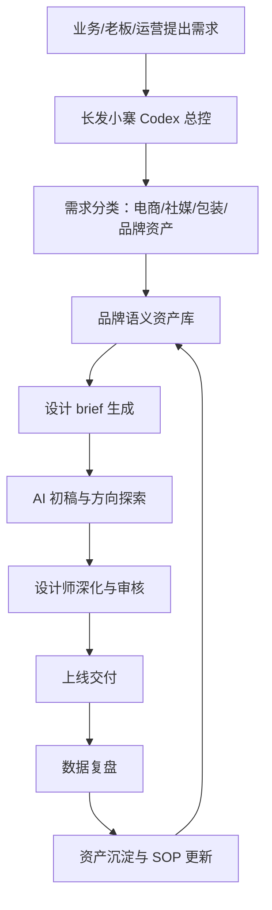
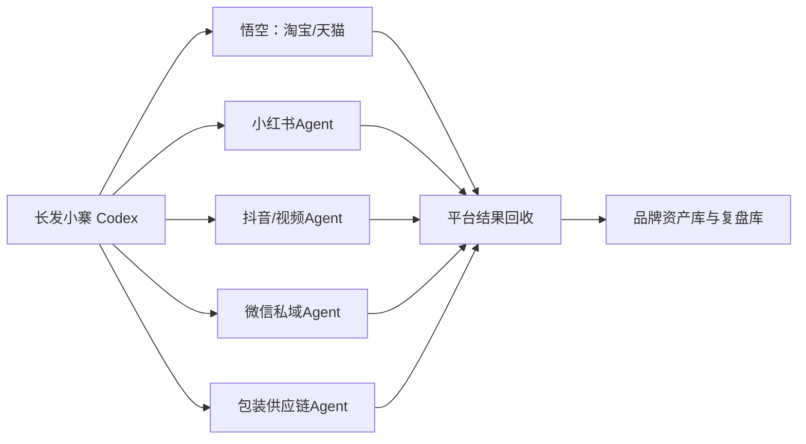
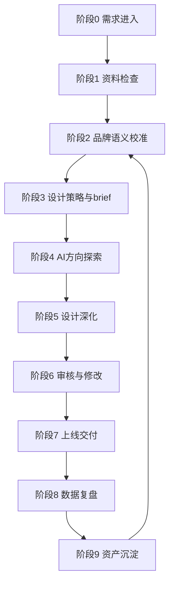
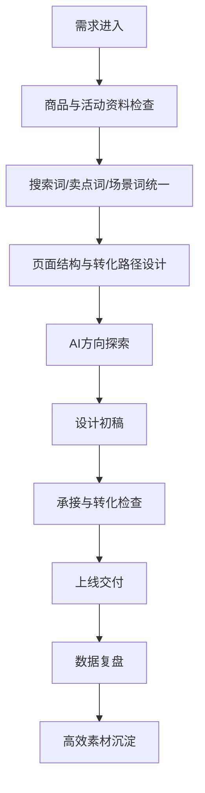
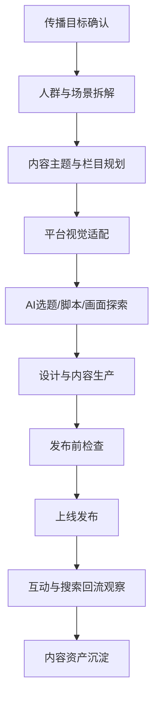
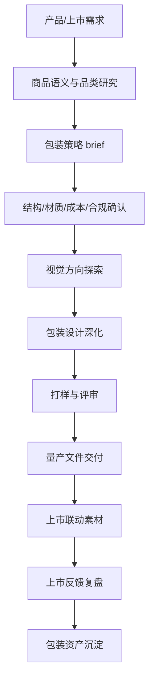
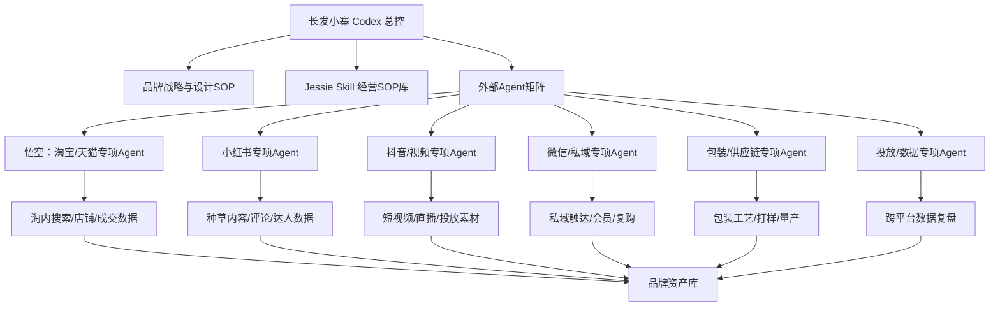
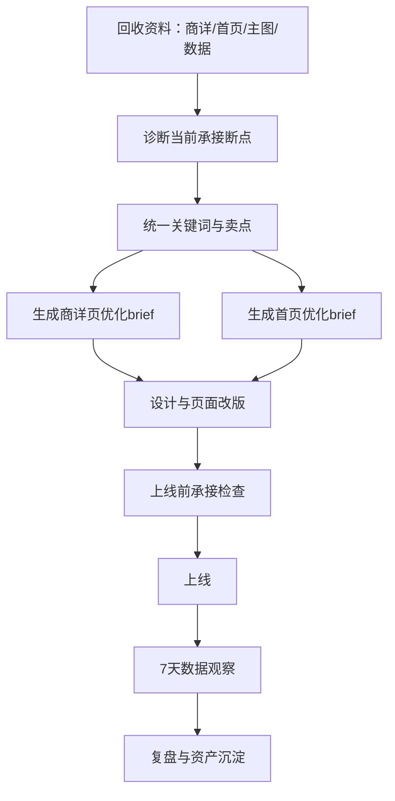

# 长发小寨品牌设计部 AI 汇报合并版

> 本文件由 00-10 号文档合并生成，便于通读、打印或转成 Word/PPT。

---

# 长发小寨品牌设计部 AI 汇报文件包

## 文件定位

这组文件用于把现有「长发小寨专属 Codex」架构，升级成面向品牌设计部的可汇报、可执行方案。它不是单纯讲 AI 工具，而是把品牌设计部的电商设计、品牌社媒推广、包装设计三条核心工作线，统一放进一个 AI 经营与设计协同系统里。

## 已整合的项目资料

- `长发小寨专属Codex蓝图.md`
- `skills/changfa-xiaozhai-codex/SKILL.md`
- `skills/changfa-xiaozhai-codex/references/skill-routing.md`
- `skills/changfa-xiaozhai-codex/references/external-ai-routing.md`
- `jessie-skills/_skill_manifest.md`
- Jessie 35 个 Skill 的业务能力框架

## 文档清单

| 文件 | 用途 | 适合对象 |
|---|---|---|
| `01_品牌设计部AI战略汇报.md` | 对老板/史总汇报整体判断、架构与阶段路线 | 老板、业务负责人 |
| `02_品牌设计部统筹模型.md` | 说明品牌设计部如何从接需求部门升级为品牌资产中台 | 设计负责人、品牌负责人 |
| `03_品牌设计全流程SOP总纲.md` | 总流程大纲，统一电商、社媒、包装三条线 | 品牌设计部全员 |
| `04_电商设计SOP.md` | 商品页、活动页、主图、详情页、投放素材等电商设计流程 | 电商设计、运营、电商负责人 |
| `05_品牌社媒推广设计SOP.md` | 小红书、抖音、视频号、公众号等社媒推广设计流程 | 社媒运营、内容设计 |
| `06_包装设计SOP.md` | 包装策略、视觉、结构、打样、上市联动流程 | 包装设计、产品、供应链 |
| `07_AI与Skill调度手册.md` | Codex 如何调度 Jessie Skill、外部 AI 和资料资产 | AI负责人、项目推进人 |
| `08_资料补充清单.md` | 下一轮需要你补充的资料清单和优先级 | 项目负责人 |
| `09_外部Agent接入与总控协议.md` | 明确悟空等平台 Agent 的接入边界、权限和总控关系 | AI负责人、老板、平台负责人 |
| `10_AI项目总台_商详页面与首页联动.md` | 把商详页面和首页登记为 AI项目01，并接入总控、Skill 和复盘 | 电商负责人、设计负责人、AI负责人 |

## 使用顺序

1. 先用 `01_品牌设计部AI战略汇报.md` 做管理层沟通。
2. 再用 `02_品牌设计部统筹模型.md` 定组织边界和协作机制。
3. 用 `03_品牌设计全流程SOP总纲.md` 统一部门大流程。
4. 按业务线分别执行 `04`、`05`、`06`。
5. 用 `07_AI与Skill调度手册.md` 把 AI 真正接入日常工作。
6. 用 `09_外部Agent接入与总控协议.md` 管理悟空及后续新增 Agent。
7. 用 `10_AI项目总台_商详页面与首页联动.md` 启动商详页面与首页项目。
8. 用 `08_资料补充清单.md` 收集资料，进入第二轮定制化。

## 当前版本说明

当前是 1.0 架构版，已经可以汇报和启动试运行。下一版需要补入长发小寨真实品牌资料、SKU、包装文件、社媒账号、店铺页面、设计规范和业务数据后，才能变成「长发小寨真实业务版」。


---

# 长发小寨品牌设计部 AI 战略汇报

## 一句话结论

长发小寨不应该只把 AI 当作“帮设计师出图、帮运营写文案”的工具，而应该把 AI 建成品牌设计部的经营中枢：用 Codex 做总控，用 Jessie Skill 做电商增长 SOP，用外部 AI 做图文视频生产，用品牌资料库沉淀设计资产，最终让品牌设计部从“接需求的执行部门”升级为“品牌资产、内容资产、转化资产的中台”。

## 为什么现在要做

品牌设计部的工作已经不只是做图。今天的品牌设计同时影响三件事：

1. 用户是否看懂品牌。
2. 内容是否能被平台和 AI 推荐。
3. 流量进入店铺后是否能成交和复购。

如果电商设计、包装设计、社媒推广各做各的，就会出现典型断点：包装说一套、详情页说一套、社媒内容说一套、投放素材又说一套。用户心智无法沉淀，搜索词无法统一，内容流量无法回流，设计工作也无法沉淀为长期资产。

## 当前已有基础

项目里已经整理出一套可作为底座的 AI 能力库：

- 35 个 Jessie Skill，覆盖诊断、洞察、内容、搜索、承接、复盘、团队推进。
- 长发小寨 Codex 总控 Skill，用于判断任务类型并调度对应 Skill。
- Skill 路由表，用于把业务问题映射到具体 SOP。
- 外部 AI 调度原则，用于区分 Codex、千问/豆包、生图视频工具、阿里生态数据的边界。

这些能力原本偏电商内容流量，现在可以扩展为品牌设计部全流程系统。

## 对悟空的定位

悟空是阿里生态产物，更适合定位为淘宝/天猫专项 Agent。它可以帮助长发小寨处理淘内搜索、店铺承接、商品页优化、投放和成交复盘，但不适合作为全品牌总控。

长发小寨自己的 Codex 必须站在更高一层：它要同时看淘宝、社媒、包装、私域、供应链、品牌资产和团队执行。未来还会出现更多类似悟空的 Agent，长发小寨 Codex 的价值就是把这些 Agent 纳入统一调度，而不是被某一个平台 Agent 牵着走。

## 品牌设计部 AI 中枢的目标

### 目标一：统一品牌表达

把品牌定位、产品卖点、用户痛点、场景词、搜索词、包装语言、详情页语言、社媒语言统一到一套语义资产里。

### 目标二：统一设计流程

把设计需求从“谁急谁先做”变成标准流程：需求 brief、资料检查、AI 初稿、设计深化、审核、上线、复盘、资产沉淀。

### 目标三：统一增长链路

让设计不只看美观，还要服务链路：社媒种草、电商搜索、详情页承接、投放放大、复购沉淀。

### 目标四：统一资产沉淀

每一次包装、详情页、短视频、海报、社媒图、投放素材，都要沉淀成可复用的品牌视觉资产、内容资产、关键词资产和转化资产。

## 设计部覆盖范围

| 板块 | 核心任务 | AI 可辅助内容 | 关键输出 |
|---|---|---|---|
| 电商设计 | 主图、详情页、活动页、店铺首页、投放素材 | 卖点拆解、详情页结构、视觉方向、转化检查 | 商品页设计 brief、详情页结构、素材分级表 |
| 品牌社媒推广 | 小红书、抖音、视频号、公众号、私域海报 | 内容选题、脚本、图文结构、平台适配 | 内容日历、社媒视觉模板、笔记/短视频脚本 |
| 包装设计 | 包装策略、包装视觉、结构配合、打样上市 | 商品语义、货架识别、包装卖点、系列化规则 | 包装设计 brief、包装视觉规范、上市联动清单 |
| 品牌资产管理 | VI、字体、色彩、版式、图片、视频、案例 | 资产归类、语义标签、复用建议 | 品牌资产库、设计规范、复用索引 |
| 数据复盘 | 内容、电商、投放、转化、复购数据 | 异常诊断、素材评分、下一轮优化 | 周度/月度设计复盘表 |

## 推荐架构



外部 Agent 关系：



## 分阶段落地路线

### 第一阶段：2 周内，搭底座

- 整理品牌基础资料、现有 SKU、包装、店铺、社媒内容。
- 建立品牌语义资产表。
- 建立电商、社媒、包装三类设计 brief 模板。
- 选 1 个 SKU 做全链路试跑。

### 第二阶段：30 天内，跑通三条线

- 电商线：完成核心 SKU 详情页/主图/投放素材 SOP。
- 社媒线：完成 1 个月内容日历和图文/短视频模板。
- 包装线：完成包装设计需求、打样、上市联动 SOP。
- 建立周度复盘机制。

### 第三阶段：60 天内，形成部门机制

- 建立品牌设计部 AI 工作台。
- 形成素材评分和复用机制。
- 建立跨部门需求入口和审核机制。
- 把高频流程做成可重复调用的 Skill 或模板。

### 第四阶段：90 天内，进入资产化运营

- 形成品牌视觉资产库、关键词资产库、包装资产库、内容资产库。
- 用数据反向指导下一轮设计。
- 让设计部成为品牌增长链路里的中台部门。

## 需要老板拍板的事项

1. 品牌设计部是否升级为“品牌资产与增长设计中台”。
2. 是否指定一位 AI 设计流程负责人，负责推进 SOP 和资料沉淀。
3. 是否先选一个核心 SKU 做电商、社媒、包装联动试点。
4. 是否统一要求所有设计需求必须带 brief、上线目标和复盘口径。

## 汇报口径

这件事不是为了让 AI 替代设计师，而是让设计师不再从空白开始，不再重复做低价值执行，不再只对审美负责，而是对品牌一致性、内容回流、店铺承接和资产沉淀负责。


---

# 品牌设计部统筹模型

## 部门定位

品牌设计部不只是“出图部门”，而是品牌表达、视觉资产、内容资产和转化资产的中台。它连接老板战略、品牌表达、电商承接、社媒种草、包装上市和投放复盘。

## 核心职责

| 职责 | 说明 | 交付物 |
|---|---|---|
| 品牌表达统一 | 统一品牌定位、产品卖点、用户场景、关键词和视觉语言 | 品牌语义资产表、表达标准模板 |
| 视觉系统管理 | 维护色彩、字体、版式、图形、图片风格、视频风格 | 品牌视觉规范、设计模板库 |
| 电商转化设计 | 支持主图、详情页、活动页、店铺页、投放素材 | 商品页设计 brief、转化检查表 |
| 社媒内容设计 | 支持小红书、抖音、视频号、公众号、私域内容 | 内容日历、视觉模板、脚本/图文结构 |
| 包装设计管理 | 支持包装策略、包装视觉、结构打样、上市联动 | 包装设计 brief、包装规范、打样记录 |
| 数据复盘优化 | 把内容表现、搜索回流、转化数据反哺设计 | 周度/月度设计复盘表 |

## 组织角色建议

| 角色 | 核心职责 | AI 协作方式 |
|---|---|---|
| 品牌设计负责人 | 定方向、定标准、定优先级、把关最终交付 | 使用 Codex 做策略判断、SOP 调度、复盘总结 |
| 电商设计负责人 | 负责商品页、活动页、店铺页、投放素材 | 使用电商设计 SOP 和承接检查 Skill |
| 社媒视觉负责人 | 负责平台内容视觉、栏目模板、推广素材 | 使用内容设计、短视频、小红书、社媒推广 SOP |
| 包装设计负责人 | 负责包装视觉、系列规范、打样与上市联动 | 使用商品语义、包装 brief、上市联动 SOP |
| AI 流程负责人 | 管理 Skill、模板、资料库、输出归档 | 维护长发小寨 Codex 和资产库 |
| 数据/运营接口人 | 提供搜索、成交、内容、投放、复购数据 | 使用复盘模板和素材评分表 |

## 三条主工作线

### 电商设计线

目标：让用户从内容或搜索进入店铺后，被主图、详情页、活动页和评价承接住。

核心关注：卖点清晰、搜索词一致、首屏转化、信任证据、活动利益点、投放素材复用。

### 品牌社媒推广线

目标：让品牌在外部平台持续种草、建立心智、形成搜索回流。

核心关注：用户场景、内容钩子、视觉记忆点、平台适配、关键词植入、评论区引导。

### 包装设计线

目标：让包装在货架、物流、社媒、电商页面里都能传递品牌和购买理由。

核心关注：品类识别、品牌识别、卖点层级、系列化、成本工艺、合规信息、上市内容联动。

## 跨部门协作机制

| 协作对象 | 设计部要拿到什么 | 设计部要交付什么 |
|---|---|---|
| 老板/一号位 | 阶段目标、优先 SKU、预算边界、拍板标准 | 设计方向、关键风险、优先级建议 |
| 品牌/市场 | 品牌定位、活动主题、用户洞察、传播目标 | 视觉方向、内容模板、传播素材 |
| 电商/运营 | 商品数据、搜索词、页面问题、活动节奏 | 主图、详情页、活动页、转化优化建议 |
| 内容/社媒 | 平台内容计划、达人素材、脚本需求 | 社媒图文模板、短视频视觉规范 |
| 产品/供应链 | 包装尺寸、材质、工艺、成本、合规要求 | 包装方案、打样文件、上市联动素材 |
| 投放 | 素材数据、投放目标、ROI 情况 | 素材分级、复用建议、下一轮创意方向 |

## 会议节奏

| 会议 | 频率 | 参加人 | 目的 |
|---|---|---|---|
| 设计需求排期会 | 每周 1 次 | 设计负责人、运营、品牌、产品 | 确认优先级、资源和交付时间 |
| AI 设计复盘会 | 每周 1 次 | 设计、运营、AI负责人 | 看素材表现、承接问题、可复用资产 |
| 品牌表达校准会 | 每月 1 次 | 老板、品牌、设计、电商 | 校准品牌语言、视觉方向、关键词 |
| 包装上市联动会 | 每个新品节点 | 产品、设计、供应链、电商、社媒 | 确保包装、电商、社媒同步上市 |

## 设计需求标准入口

所有设计需求必须包含：

1. 业务目标：曝光、种草、搜索、转化、复购、上新、活动。
2. 使用场景：电商页、社媒图、投放素材、包装、私域、线下物料。
3. 目标人群：新客、老客、高价值人群、价格敏感人群、场景人群。
4. 核心 SKU 或产品线。
5. 关键词、卖点、信任证据。
6. 参考资料和限制条件。
7. 上线时间和复盘指标。

## 部门升级方向

短期目标：让设计需求有标准入口、有统一 brief、有可复盘口径。

中期目标：让电商、社媒、包装设计共享同一套品牌语义和视觉资产。

长期目标：让设计部成为品牌增长中台，能反向推动内容、商品、店铺和投放优化。


---

# 品牌设计全流程 SOP 总纲

## 总流程



## 阶段 0：需求进入

目标：把模糊需求变成可判断、可排期、可交付的设计任务。

必须明确：

- 这次设计服务什么业务目标。
- 属于电商设计、社媒推广、包装设计还是品牌资产建设。
- 是否绑定具体 SKU、活动、渠道或上市节点。
- 谁拍板、谁使用、谁提供数据。

输出：《设计需求登记表》

## 阶段 1：资料检查

目标：判断资料是否足够开始设计，避免设计师凭感觉补业务信息。

检查项：

- 品牌资料：定位、VI、调性、禁用规则。
- 产品资料：SKU、卖点、成分/材质、价格、目标人群。
- 渠道资料：平台、尺寸、投放规则、上线时间。
- 经营资料：搜索词、转化问题、内容表现、竞品样本。
- 参考资料：历史设计、包装、详情页、社媒内容。

输出：《资料完整度检查表》

## 阶段 2：品牌语义校准

目标：先统一“说什么”，再决定“怎么设计”。

校准内容：

- 品牌核心表达。
- 产品购买理由。
- 用户痛点与使用场景。
- 搜索词、卖点词、场景词。
- 信任证据：资质、评价、数据、达人背书、实验/工艺证明。

可调用 Skill：

- `brand-semantic-asset-sop`
- `ai-product-semantic-reconstruction`
- `keyword-unified-sop`
- `ai-trust-evidence-chain`

输出：《品牌/产品语义资产表》

## 阶段 3：设计策略与 brief

目标：把业务目标翻译成设计任务书。

设计 brief 必须包含：

- 项目背景。
- 目标人群。
- 使用渠道。
- 核心信息层级。
- 视觉方向。
- 必须出现的信息。
- 禁止事项。
- 交付规格。
- 审核人和时间。
- 复盘指标。

输出：《设计 brief》

## 阶段 4：AI 方向探索

目标：用 AI 快速探索方向，但不直接把 AI 图当最终交付。

AI 可用于：

- 视觉风格探索。
- 竞品结构拆解。
- 卖点表达扩写。
- 详情页结构建议。
- 社媒内容选题。
- 包装货架识别模拟。
- 多版本文案与画面方向。

输出：《方向探索稿》《AI 生成记录》

## 阶段 5：设计深化

目标：设计师基于已确认方向，完成正式设计。

深化内容：

- 版式、字体、色彩、图片、图形、信息层级。
- 系列化统一。
- 渠道适配。
- 转化路径和行动提示。
- 印刷、打样或上线规格。

输出：《设计初稿》

## 阶段 6：审核与修改

目标：用统一标准审核，减少纯主观修改。

审核维度：

- 品牌一致性。
- 信息准确性。
- 渠道适配性。
- 转化承接性。
- 合规与风险。
- 可复用性。

输出：《修改记录》《终稿确认》

## 阶段 7：上线交付

目标：确保设计不是只交文件，而是完成渠道上线和使用交接。

交付内容：

- 源文件。
- 导出文件。
- 尺寸规格。
- 使用说明。
- 上线位置。
- 负责人。
- 上线时间。

输出：《上线交付清单》

## 阶段 8：数据复盘

目标：判断设计是否帮助业务结果改善。

不同设计看不同指标：

| 类型 | 核心指标 |
|---|---|
| 电商设计 | 点击率、收藏加购、转化率、跳失率、ROI、搜索进店 |
| 社媒推广 | 完播率、互动率、收藏率、评论关键词、搜索回流 |
| 包装设计 | 货架识别、用户反馈、开箱传播、复购评价、渠道反馈 |
| 投放素材 | 点击率、转化率、搜索回流、复用价值、素材衰减速度 |

输出：《设计复盘表》

## 阶段 9：资产沉淀

目标：每次设计都沉淀为下一次可复用资产。

沉淀内容：

- 视觉资产：模板、配色、版式、图片、插画、图标。
- 语义资产：卖点、关键词、场景词、问答语料。
- 内容资产：脚本、笔记、海报、短视频结构。
- 转化资产：高转化详情页结构、高效投放素材。
- 包装资产：系列规范、材质工艺、打样经验。

输出：《品牌设计资产库更新记录》

## 三条业务线执行关系

| 业务线 | 起点 | 重点 | 终点 |
|---|---|---|---|
| 电商设计 | 商品/活动需求 | 转化承接 | 页面上线与转化复盘 |
| 社媒推广 | 内容/传播需求 | 种草与回流 | 内容发布与互动复盘 |
| 包装设计 | 产品/上市需求 | 识别与信任 | 打样量产与上市联动 |

## 总 SOP 的关键原则

1. 没有 brief，不进入正式设计。
2. 没有语义校准，不直接做视觉。
3. 没有渠道目标，不判断设计好坏。
4. 没有复盘，不算项目结束。
5. 没有沉淀，不算真正完成。


---

# 电商设计 SOP

## 适用范围

适用于淘宝/天猫店铺首页、商品主图、详情页、活动页、直播间物料、投放素材、超级短视频封面、客服承接图、私域转化图等电商场景。

## 核心目标

电商设计不是单纯做“好看的页面”，而是让用户从内容、搜索、广告、活动进入店铺后，能在最短时间内看懂购买理由、建立信任、完成下一步动作。

## 标准流程



## 阶段 1：需求进入

必须明确：

- 设计类型：主图、详情页、店铺首页、活动页、投放素材、直播物料。
- 核心 SKU 或活动。
- 本次目标：提升点击、提升转化、承接种草、活动爆发、老客复购。
- 上线时间。
- 复盘指标。

输出：《电商设计需求登记表》

## 阶段 2：商品与活动资料检查

必须收集：

- 商品基础信息：品名、规格、价格、功效/功能、材质/成分。
- 核心卖点：主卖点、辅助卖点、差异点。
- 用户痛点：用户为什么需要它。
- 信任证据：评价、资质、工艺、数据、达人背书、销量。
- 活动信息：优惠、赠品、机制、时间。
- 历史数据：点击率、转化率、收藏加购、跳失率、投放 ROI。

输出：《电商设计资料完整度检查表》

## 阶段 3：关键词与卖点统一

电商设计前必须统一三类词：

| 类型 | 说明 | 应用位置 |
|---|---|---|
| 搜索词 | 用户会搜什么 | 标题、主图、详情页、投放关键词 |
| 卖点词 | 用户为什么买 | 首屏、卖点模块、利益点文案 |
| 场景词 | 用户在什么情况下用 | 使用场景图、社媒内容、详情页场景模块 |

可调用 Skill：

- `keyword-unified-sop`
- `ai-product-semantic-reconstruction`
- `ai-content-search-connect`

输出：《商品关键词与卖点统一表》

## 阶段 4：页面结构与转化路径设计

### 主图结构

1. 第一张：核心购买理由。
2. 第二张：核心卖点或场景。
3. 第三张：信任证据。
4. 第四张：规格/适用人群。
5. 第五张：活动利益点或对比优势。

### 详情页结构

1. 首屏：一句话购买理由。
2. 痛点场景：用户为什么需要。
3. 产品解决方案：产品如何解决。
4. 核心卖点：分层展开。
5. 信任证据：评价、资质、数据、工艺。
6. 使用场景：真实使用/搭配/前后对比。
7. 规格参数：明确选择。
8. 促单动作：优惠、服务、保障。

### 活动页结构

1. 活动主题。
2. 核心利益点。
3. 爆款 SKU。
4. 组合购买路径。
5. 会员/私域承接。

可调用 Skill：

- `ai-store-reception-optimization`
- `ai-content-reception-checklist`
- `ai-external-content-internal-receiving`

输出：《页面结构草图》《转化路径表》

## 阶段 5：AI 方向探索

AI 可辅助：

- 详情页模块结构。
- 商品卖点视觉化。
- 竞品页面拆解。
- 产品摄影场景提示词。
- 投放素材创意方向。
- 活动页利益点文案。

注意：AI 生成结果只用于探索，设计师必须按品牌规范和平台规范深化。

输出：《AI 方向探索记录》

## 阶段 6：设计初稿

设计师完成：

- 页面视觉方案。
- 信息层级。
- 图片/视频/图标处理。
- SKU 规格与活动信息展示。
- 移动端可读性检查。
- 多尺寸导出。

输出：《电商设计初稿》

## 阶段 7：承接与转化检查

审核问题：

1. 首屏 3 秒内能否看懂购买理由？
2. 主图与标题、搜索词是否一致？
3. 详情页是否延续社媒种草内容？
4. 卖点是否有证据支撑？
5. 活动利益点是否清晰？
6. 是否有下一步动作：购买、收藏、加购、咨询、领券？
7. 是否适配投放素材复用？

输出：《电商承接检查表》

## 阶段 8：上线交付

交付内容：

- 源文件。
- 平台尺寸图。
- 页面切图。
- 活动页素材。
- 投放素材版本。
- 上线位置和负责人。

输出：《电商设计上线清单》

## 阶段 9：数据复盘

复盘指标：

| 场景 | 指标 |
|---|---|
| 主图 | 点击率、搜索进店率 |
| 详情页 | 停留时长、跳失率、收藏加购、转化率 |
| 活动页 | 领券率、加购率、成交转化 |
| 投放素材 | 点击率、转化率、ROI、素材衰减 |
| 承接链路 | 内容到搜索、搜索到进店、进店到成交 |

可调用 Skill：

- `quality-material-screening`
- `ai-business-judgment`
- `post-promo-content-review`

输出：《电商设计复盘表》

## 阶段 10：资产沉淀

沉淀内容：

- 高点击主图结构。
- 高转化详情页模块。
- 可复用卖点表达。
- 投放有效素材。
- 活动页模板。
- 商品关键词与信任证据。

输出：《电商设计资产库更新记录》

## 电商设计禁区

- 不只追求视觉好看，忽略搜索词和购买理由。
- 不只复制竞品结构，忽略品牌差异。
- 不只看点击率，忽略进店后的承接和成交。
- 不在没有资料和 brief 的情况下直接开图。


---

# 品牌社媒推广设计 SOP

## 适用范围

适用于小红书、抖音、视频号、公众号、微博、B站、朋友圈、社群、私域海报、达人合作素材、品牌活动传播素材等场景。

## 核心目标

品牌社媒推广设计的目标不是单条内容好看，而是持续让用户看见、理解、记住、搜索并愿意进一步了解品牌。社媒设计必须同时服务品牌心智、内容互动和电商回流。

## 标准流程



## 阶段 1：传播目标确认

必须明确：

- 这次内容为了什么：品牌认知、产品种草、活动引流、新品上市、复购召回。
- 目标平台：小红书、抖音、视频号、公众号、私域等。
- 目标人群。
- 核心 SKU 或品牌主题。
- 是否需要回流到淘宝/天猫/私域。

输出：《社媒推广需求登记表》

## 阶段 2：人群与场景拆解

拆解维度：

| 维度 | 问题 |
|---|---|
| 人群 | 谁最可能被这条内容打动？ |
| 痛点 | 他现在有什么未被解决的问题？ |
| 场景 | 他在什么情境下会想起这个产品？ |
| 触发点 | 什么标题/画面会让他停下来？ |
| 搜索动作 | 看完之后他会搜什么？ |

可调用 Skill：

- `high-value-audience-breakdown`
- `competitor-trend-insight`
- `ai-content-opportunity`

输出：《社媒人群与场景表》

## 阶段 3：内容主题与栏目规划

建议建立固定栏目，而不是每次临时想内容：

| 栏目类型 | 作用 | 示例输出 |
|---|---|---|
| 痛点共鸣 | 让用户觉得“说的是我” | 场景海报、短视频开头 |
| 产品解释 | 把卖点讲成人话 | 图文拆解、口播脚本 |
| 使用场景 | 展示真实使用方式 | 场景图、短视频分镜 |
| 信任证据 | 让用户相信 | 评价图、证据链内容 |
| 活动转化 | 引导搜索/进店/私域 | 活动图、福利海报 |
| 品牌价值 | 建立长期心智 | 品牌故事、主张海报 |

可调用 Skill：

- `win-content-design`
- `ai-content-standard-template`
- `ai-content-reference-map`

输出：《社媒栏目规划表》《月度内容日历》

## 阶段 4：平台视觉适配

不同平台的设计重点不同：

| 平台 | 视觉重点 | 内容重点 |
|---|---|---|
| 小红书 | 封面标题、生活方式感、信息密度 | 种草、经验、清单、对比 |
| 抖音 | 前 3 秒画面、人物/产品动作、字幕 | 钩子、冲突、使用场景 |
| 视频号 | 信任感、品牌感、适合转发 | 专业解释、品牌故事、用户案例 |
| 公众号 | 长图结构、版式秩序、阅读体验 | 深度内容、活动说明 |
| 私域 | 清晰利益点、行动按钮感 | 复购、福利、老客触达 |

输出：《平台视觉适配表》

## 阶段 5：AI 选题/脚本/画面探索

AI 可辅助：

- 生成选题池。
- 生成小红书标题和笔记结构。
- 生成短视频脚本和分镜。
- 生成封面文案。
- 生成画面参考提示词。
- 改写不同平台版本。

可调用 Skill：

- `xiaohongshu-note-generator`
- `short-video-script-generator`
- `private-domain-content`

输出：《AI 内容方向初稿》

## 阶段 6：设计与内容生产

设计师完成：

- 封面图。
- 信息长图。
- 短视频视觉包装。
- 字幕与版式规范。
- 社媒活动海报。
- 私域触达图。

内容团队完成：

- 标题。
- 正文。
- 口播。
- 评论区引导。
- 搜索/进店提示。

输出：《社媒内容成稿》

## 阶段 7：发布前检查

检查项：

1. 开头是否有钩子？
2. 画面是否符合品牌调性？
3. 卖点是否讲成人话？
4. 是否植入搜索词、场景词或品牌词？
5. 是否有评论区或进店引导？
6. 是否避免夸大宣传和违规表达？
7. 是否能沉淀为后续投放素材？

可调用 Skill：

- `ai-content-chain-check`
- `ai-content-reception-checklist`

输出：《社媒发布前检查表》

## 阶段 8：上线发布

交付内容：

- 平台版本文件。
- 标题和正文。
- 封面。
- 标签/话题。
- 发布时间。
- 发布人。
- 评论区引导话术。

输出：《社媒发布清单》

## 阶段 9：互动与搜索回流观察

复盘指标：

| 指标 | 看什么 |
|---|---|
| 曝光 | 内容是否被看见 |
| 完播/停留 | 内容是否抓住用户 |
| 点赞/收藏/评论 | 是否产生互动与兴趣 |
| 评论关键词 | 用户真实关心什么 |
| 品牌词/品类词搜索 | 是否带来搜索回流 |
| 进店/私域动作 | 是否进入承接链路 |

可调用 Skill：

- `ai-search-reflow-observation-sop`
- `u-shape-content-reflow`
- `quality-material-screening`

输出：《社媒内容复盘表》

## 阶段 10：内容资产沉淀

沉淀内容：

- 高互动标题。
- 高收藏图文结构。
- 高完播脚本结构。
- 用户评论问题。
- 可投放素材。
- 可回流关键词。
- 平台视觉模板。

输出：《社媒内容资产库更新记录》

## 社媒推广设计禁区

- 不只追热点，忽略品牌长期表达。
- 不只看点赞，忽略搜索回流和承接。
- 不只做单条内容，忽略栏目化和资产化。
- 不让不同平台各说各话，必须共享品牌语义资产。


---

# 包装设计 SOP

## 适用范围

适用于新品包装、老品包装升级、系列包装规范、礼盒包装、活动限定包装、电商发货包装、样品装、组合装、包装上市联动素材。

## 核心目标

包装设计不只是产品外壳，而是品牌识别、购买理由、信任证据和内容传播的第一载体。好的包装要同时服务货架识别、电商展示、社媒传播、用户开箱和复购记忆。

## 标准流程



## 阶段 1：产品/上市需求确认

必须明确：

- 新品、老品升级、系列延展还是活动限定。
- 产品定位和价格带。
- 销售渠道：电商、线下、礼赠、私域、跨境。
- 上市时间。
- 成本边界。
- 包装规格和供应链限制。

输出：《包装设计需求登记表》

## 阶段 2：商品语义与品类研究

包装设计前先统一“这个产品为什么值得买”。

拆解内容：

| 维度 | 问题 |
|---|---|
| 品类识别 | 用户第一眼知道这是什么吗？ |
| 品牌识别 | 第一眼知道是谁的产品吗？ |
| 购买理由 | 包装上最该被看见的卖点是什么？ |
| 人群场景 | 谁会买、什么时候用、为什么用？ |
| 信任证据 | 有哪些资质、工艺、评价、数据可上包装或延展内容？ |
| 系列关系 | 它和其他 SKU 如何形成家族感？ |

可调用 Skill：

- `brand-semantic-asset-sop`
- `ai-product-semantic-reconstruction`
- `ai-trust-evidence-chain`

输出：《包装商品语义表》《包装信息层级表》

## 阶段 3：包装策略 brief

包装 brief 必须包含：

- 产品定位。
- 目标用户。
- 核心购买理由。
- 信息层级：品牌、品名、卖点、规格、证据、合规。
- 视觉关键词。
- 系列化规则。
- 成本与工艺限制。
- 渠道展示场景。
- 竞品参考。
- 禁止事项。

输出：《包装设计 brief》

## 阶段 4：结构/材质/成本/合规确认

包装不是纯视觉，必须先确认现实边界：

- 包装形态：盒、袋、瓶、罐、贴标、礼盒、组合装。
- 材质工艺：纸张、膜材、烫金、UV、击凸、专色等。
- 成本范围。
- 运输保护。
- 条码、生产信息、合规文案。
- 印刷文件要求。

输出：《包装技术与合规检查表》

## 阶段 5：视觉方向探索

AI 可辅助：

- 竞品包装视觉归类。
- 货架识别方向。
- 风格关键词生成。
- 系列化版式探索。
- 包装卖点表达。
- 电商首图/社媒开箱场景联想。

注意：AI 不能替代最终包装文件，尤其不能直接生成可印刷终稿。所有文字、条码、合规、尺寸、工艺必须人工确认。

输出：《包装视觉方向板》

## 阶段 6：包装设计深化

设计师完成：

- 正面主视觉。
- 侧面/背面信息。
- 系列色彩和识别系统。
- 卖点层级。
- 图形、图标、插画、摄影处理。
- 印刷工艺标注。
- 展开图文件。

输出：《包装设计初稿》

## 阶段 7：打样与评审

评审维度：

1. 远看是否能识别品牌和品类？
2. 近看是否能读懂卖点和规格？
3. 是否符合品牌调性？
4. 是否与电商详情页、社媒内容语言一致？
5. 材质工艺是否能落地？
6. 成本是否可接受？
7. 是否有合规风险？

输出：《包装打样评审表》《修改记录》

## 阶段 8：量产文件交付

交付内容：

- 包装源文件。
- 印刷展开图。
- 字体/图片/链接文件。
- 工艺说明。
- 色值说明。
- 条码和合规信息确认。
- 打样确认记录。

输出：《包装量产交付清单》

## 阶段 9：上市联动素材

包装上市不能只交给供应链，还要同步电商和社媒：

- 电商主图：包装外观与核心卖点。
- 详情页：包装升级说明、规格解释、开箱体验。
- 社媒内容：新品包装故事、开箱视频、设计理念。
- 私域内容：老客上新通知、组合购买建议。
- 投放素材：包装识别点和购买理由。

可调用 Skill：

- `ai-content-reference-map`
- `short-video-script-generator`
- `xiaohongshu-note-generator`
- `ai-store-reception-optimization`

输出：《包装上市联动清单》

## 阶段 10：上市反馈复盘

复盘指标：

| 维度 | 指标 |
|---|---|
| 货架/页面识别 | 点击率、用户第一眼反馈、客服咨询问题 |
| 内容传播 | 开箱内容互动、达人反馈、社媒评论关键词 |
| 转化 | 新品转化率、收藏加购、组合购买 |
| 供应链 | 打样次数、返工原因、量产问题 |
| 用户反馈 | 包装评价、破损率、复购评价 |

输出：《包装上市复盘表》

## 阶段 11：包装资产沉淀

沉淀内容：

- 包装系列规范。
- 信息层级模板。
- 包装卖点表达。
- 材质工艺记录。
- 打样问题库。
- 上市联动素材。
- 用户反馈和改版建议。

输出：《包装资产库更新记录》

## 包装设计禁区

- 不只做视觉风格，忽略货架和电商识别。
- 不只追求高级感，忽略用户能否看懂品类和卖点。
- 不在合规、尺寸、工艺未确认前直接定稿。
- 不让包装、电商详情页、社媒内容各说各话。


---

# AI 与 Skill 调度手册

## 总控原则

Codex 是总控，不是单个工具。所有 AI 工具都要被放进业务流程里使用：

- Codex 负责判断、拆解、调度、整合、校验和沉淀。
- Jessie Skill 负责电商内容流量和经营 SOP。
- 外部 AI 负责图像、视频、语义扩写、素材生成等专项能力。
- 悟空这类平台 Agent 负责特定平台任务，例如淘宝/天猫域内的搜索、承接、投放和成交。
- 设计师负责审美判断、品牌把关、落地文件和最终质量。

## 品牌设计部任务分类

| 任务类型 | 典型需求 | 主调度 |
|---|---|---|
| 品牌表达统一 | 品牌定位、卖点、关键词、语义资产 | Codex + `brand-semantic-asset-sop` |
| 电商设计 | 主图、详情页、活动页、投放素材 | Codex + 电商承接类 Skill |
| 社媒推广 | 小红书、抖音、视频号、私域海报 | Codex + 内容生产类 Skill |
| 包装设计 | 包装 brief、视觉方向、上市联动 | Codex + 商品语义/信任证据 Skill |
| 数据复盘 | 素材评分、搜索回流、转化判断 | Codex + 复盘/经营判断 Skill |
| 团队推进 | 分工、排期、甘特图、7/60天计划 | Codex + 执行复盘类 Skill |

## Jessie Skill 调度地图

### 1. 品牌与商品语义

适用于品牌定位、SKU 卖点、包装语言、详情页语言、社媒语言统一。

优先调用：

- `brand-semantic-asset-sop`
- `ai-product-semantic-reconstruction`
- `ai-trust-evidence-chain`
- `keyword-unified-sop`

输出：

- 品牌语义资产表。
- 商品推荐理由语料。
- 信任证据链。
- 三类关键词表。

### 2. 电商设计与承接

适用于主图、详情页、活动页、店铺页、投放素材。

优先调用：

- `ai-store-reception-optimization`
- `ai-content-reception-checklist`
- `ai-external-content-internal-receiving`
- `ai-content-search-connect`

输出：

- 店铺承接优化动作清单。
- 内容到承接检查表。
- 外种内收路径图。
- 内容-搜索-承接连接表。

### 3. 社媒推广与内容生产

适用于小红书、抖音、视频号、私域内容。

优先调用：

- `win-content-design`
- `short-video-script-generator`
- `xiaohongshu-note-generator`
- `ai-content-standard-template`
- `private-domain-content`

输出：

- 内容分层设计。
- 短视频脚本。
- 小红书笔记。
- 内容表达标准。
- 私域触达内容。

### 4. 包装设计与上市联动

Jessie Skill 里没有独立包装设计 Skill，但可以由以下能力组合：

- `brand-semantic-asset-sop`：包装品牌表达。
- `ai-product-semantic-reconstruction`：包装卖点与购买理由。
- `ai-trust-evidence-chain`：包装信任证据。
- `ai-content-reference-map`：包装上市后的内容可引用地图。
- `short-video-script-generator`：包装开箱/新品视频。
- `xiaohongshu-note-generator`：包装上新种草笔记。

输出：

- 包装设计 brief。
- 包装信息层级表。
- 包装上市联动清单。
- 包装社媒内容脚本。

### 5. 素材筛选与复盘

适用于判断哪些设计、内容、素材值得继续放大。

优先调用：

- `quality-material-screening`
- `ai-search-reflow-observation-sop`
- `post-promo-content-review`
- `ai-business-judgment`

输出：

- 素材评分表。
- 搜索回流观察表。
- 内容资产复盘表。
- AI 辅助经营判断表。

### 6. 团队执行与排期

适用于设计部跨电商、社媒、包装推进。

优先调用：

- `ai-roles-division`
- `team-leader-promotion-sop`
- `ai-back-to-store-7day-sop`
- `ai-post-training-gantt-chart`
- `ai-60day-training-camp`

输出：

- 三角色分工表。
- 负责人推进表。
- 7天行动清单。
- 甘特图。
- 60天任务表。

## 外部 AI 调度边界

| 工具类型 | 适合做 | 不适合做 |
|---|---|---|
| 千问/豆包/通义 | 商品识别、卖点扩写、内容初稿、资料整理 | 最终经营判断、品牌拍板 |
| 生图工具 | 视觉方向、场景图、详情图概念、产品摄影探索 | 最终印刷文件、合规包装终稿 |
| 视频工具 | 产品展示、口播、开箱、使用场景视频初稿 | 最终无审校发布 |
| 阿里生态数据 | 搜索、投放、成交、承接复盘 | 替代品牌策略判断 |
| 悟空类平台 Agent | 淘宝/天猫平台内的商品、搜索、店铺、投放、成交建议 | 跨平台品牌总控、包装策略、社媒传播总判断 |
| Codex | 调度、写 SOP、生成文档/表格、整理知识库 | 代替老板最终拍板 |

## 悟空的接入方式

悟空应被定位为淘宝/天猫专项 Agent。它可以参与淘内经营判断，但不能替代长发小寨 Codex 的总控角色。

推荐分工：

| 事项 | 悟空负责 | Codex负责 |
|---|---|---|
| 淘内搜索 | 分析搜索词、商品标题、搜索承接 | 判断这些词是否与品牌社媒和包装语言一致 |
| 店铺承接 | 检查商品页、活动页、店铺页 | 判断是否接住外部种草和品牌表达 |
| 投放建议 | 给出阿里生态投放优化方向 | 判断素材是否值得放大、是否沉淀为资产 |
| 成交复盘 | 看淘内成交与转化 | 合并社媒、包装、私域和品牌资产复盘 |
| 页面优化 | 给出淘内页面建议 | 生成设计 brief 并交给设计部执行 |

接入原则：

1. Codex 给悟空分配任务。
2. 悟空返回淘内建议。
3. Codex 做跨平台验证。
4. 设计部按 SOP 执行。
5. 结果回到品牌资产库和复盘库。

## 标准调用流程

1. 先判断任务归属：电商、社媒、包装、品牌资产、复盘、团队执行。
2. 读取对应 SOP。
3. 判断所需资料是否齐全。
4. 调用对应 Jessie Skill 或外部 AI。
5. 输出初稿。
6. 按品牌、渠道、转化、合规四个维度校验。
7. 形成交付物。
8. 上线后复盘并沉淀进资产库。

## 品牌设计部 AI 工作台建议

建议建立 6 个固定资料区：

1. 品牌资料库：定位、VI、字体、色彩、品牌故事。
2. SKU 资料库：产品信息、卖点、规格、价格、证据。
3. 视觉资产库：主图、详情页、包装、社媒模板、投放素材。
4. 内容资产库：脚本、笔记、标题、私域话术。
5. 数据复盘库：搜索、点击、转化、ROI、用户反馈。
6. SOP 与模板库：本文件包、Jessie Skill、表格模板。

## 当前优先级

第一优先级：先把品牌语义资产和 SKU 资料补齐。

第二优先级：选 1 个核心 SKU 跑通电商设计、社媒推广、包装联动。

第三优先级：建立周度复盘和资产沉淀机制。


---

# 资料补充清单

## 目的

当前文档包是 1.0 架构版。要升级成“长发小寨真实业务版”，需要补充品牌、产品、设计、渠道、数据和组织资料。资料越完整，AI 生成的 SOP、设计 brief、复盘判断和执行计划越贴近实际。

## 第一优先级：必须补

### 品牌基础资料

- 品牌名称、品牌定位、品牌故事。
- 目标用户画像。
- 品牌核心卖点。
- 品牌调性关键词。
- 现有 VI：LOGO、色彩、字体、辅助图形、版式规范。
- 品牌禁用规则：不能说什么、不能怎么设计。

### 核心 SKU 资料

- 当前重点 SKU 清单。
- 每个 SKU 的产品图、包装图、价格、规格、成分/材质。
- 核心卖点和差异点。
- 用户评价、问大家、客服高频问题。
- 资质、工艺、检测、销量、达人背书等信任证据。

### 现有设计资产

- 店铺首页截图。
- 商品主图、详情页、活动页。
- 包装设计源文件或图片。
- 小红书/抖音/视频号/公众号历史内容。
- 投放素材。
- 过往活动海报和私域海报。

## 第二优先级：最好补

### 电商数据

- 主图点击率。
- 详情页转化率、跳失率、收藏加购。
- 搜索词数据。
- 活动页数据。
- 投放素材数据：点击、转化、ROI、消耗。
- 超级短视频/万相台相关数据。

### 社媒数据

- 小红书笔记数据：曝光、阅读、收藏、评论。
- 抖音/视频号数据：播放、完播、互动、转粉。
- 用户评论关键词。
- 达人合作内容和数据。
- 哪些内容带来搜索或进店。

### 包装与供应链资料

- 现有包装尺寸、材质、工艺。
- 打样记录。
- 成本范围。
- 供应商文件要求。
- 合规信息模板。
- 用户对包装的评价和问题。

## 第三优先级：后续补

### 组织协作资料

- 品牌设计部人员分工。
- 电商、品牌、产品、供应链、投放、客服接口人。
- 当前需求流转方式。
- 审核与拍板机制。
- 常见返工原因。

### 历史复盘资料

- 大促复盘。
- 新品上市复盘。
- 包装升级复盘。
- 内容投放复盘。
- 设计项目延期或返工案例。

## 建议的资料整理方式

建议在项目里建立以下目录：

```text
assets/
  brand/
  sku/
  ecommerce/
  social/
  packaging/
  data/
  reviews/
  references/
```

每个 SKU 建议按如下结构整理：

```text
sku/产品名/
  01_产品基础信息.md
  02_卖点与证据.md
  03_用户评价与问题.md
  04_主图详情页/
  05_包装/
  06_社媒内容/
  07_数据/
```

## 我下一步可以直接帮你做的事

### 任务一：建立品牌设计部资料库目录

在项目里创建标准资料夹，并放入说明文件，方便你和团队往里面丢资料。

### 任务二：做核心 SKU 试点

你给我一个 SKU 的图片、详情页、包装、社媒内容和数据，我可以按这套 SOP 输出：

- SKU 语义资产表。
- 电商详情页优化 brief。
- 社媒推广内容计划。
- 包装设计/优化 brief。
- 7 天执行计划。

### 任务三：生成 Word/PPT 汇报版

当前是 Markdown 文件包。如果要正式汇报，我可以继续把它整理成：

- Word 汇报文档。
- PPT 汇报大纲。
- 老板版 1 页纸摘要。
- 部门执行版 SOP 手册。

## 资料不足时的处理原则

如果资料不全，也可以先做初版，但会标注：

- 已确认的信息。
- 基于经验的假设。
- 必须人工确认的内容。
- 下一步需要补充的数据。

这样不会因为等资料而停住，也不会让 AI 假装自己知道全部事实。


---

# 外部 Agent 接入与总控协议

## 核心判断

悟空这类 Agent AI 应该被视为“平台专项 Agent”，不是长发小寨的总控。悟空的优势在淘宝/天猫/阿里生态，适合处理淘内搜索、商品承接、店铺经营、投放和成交相关任务；但品牌设计部的整体经营还覆盖包装、社媒、内容、私域、供应链、品牌资产和跨平台增长，所以必须由长发小寨自己的 Codex 做总控。

## 总控关系



## 悟空的推荐定位

| 项目 | 定位 |
|---|---|
| 角色 | 淘宝/天猫生态专项 Agent |
| 适合任务 | 淘内搜索、商品标题、店铺承接、活动页、投放、成交复盘 |
| 输入 | SKU、商品页、搜索词、投放数据、活动节奏、成交数据 |
| 输出 | 淘内优化建议、承接检查、投放建议、成交复盘 |
| 不应负责 | 品牌总战略、跨平台内容判断、包装策略、社媒传播总控 |
| 管理方式 | 由长发小寨 Codex 分配任务、回收结果、统一复盘 |

## 外部 Agent 接入四问

任何新 Agent 接进来前，先回答四个问题：

1. 它服务哪个平台或业务域？
2. 它能读什么数据、能写什么结果？
3. 它的输出如何被验证？
4. 它产生的资产沉淀到哪里？

## Agent 分级

| 等级 | 类型 | 权限 |
|---|---|---|
| L1 工具型 Agent | 只生成文案、图片、脚本、提示词 | 可直接调用，但需要人工审核 |
| L2 平台型 Agent | 读取平台数据并给建议，如悟空 | 可参与判断，但不能独自拍板 |
| L3 执行型 Agent | 可改投放、改页面、改商品信息 | 必须人工确认后执行 |
| L4 总控型 Agent | 跨平台调度、拆解任务、合并判断 | 当前只保留给长发小寨 Codex |

## 接入流程

1. 登记 Agent：名称、平台、能力、账号权限、数据范围。
2. 定义边界：能做什么、不能做什么、哪些动作需要人工确认。
3. 设计输入模板：Codex 给它什么资料，它按什么格式输出。
4. 设计输出验收：Codex 用品牌一致性、链路完整性、数据可验证性审核。
5. 沉淀结果：把有效输出写回品牌资产库、内容资产库、设计资产库或数据复盘库。

## 标准任务分发模板

| 字段 | 内容 |
|---|---|
| Agent 名称 |  |
| 所属平台/业务域 |  |
| 本次任务目标 |  |
| 输入资料 |  |
| 不可越界事项 |  |
| 输出格式 |  |
| 验收标准 |  |
| 结果沉淀位置 |  |

## Codex 的总控职责

Codex 需要做四件事：

1. 分配：判断哪个 Agent 最适合处理当前任务。
2. 翻译：把品牌目标翻译成 Agent 能执行的输入。
3. 验收：检查 Agent 输出是否符合品牌、设计、平台和经营目标。
4. 沉淀：把结果变成资产，而不是停留在一次性对话。

## 风险控制

- 不让任何平台 Agent 单独决定品牌方向。
- 不让淘宝 Agent 反向绑架社媒、包装和品牌表达。
- 不让生成型 Agent 直接产出未经审核的上线素材。
- 不让数据型 Agent 只按平台指标优化，忽略品牌长期资产。
- 所有关键动作都要保留输入、输出、负责人和复盘记录。

## 未来可接入 Agent 清单

| Agent 类型 | 可能来源 | 主要用途 |
|---|---|---|
| 淘宝/天猫 Agent | 悟空、阿里系工具 | 淘内搜索、承接、投放、成交 |
| 小红书 Agent | 小红书生态工具 | 种草笔记、达人、评论洞察 |
| 抖音 Agent | 巨量/剪映/视频生成工具 | 短视频、直播、投放素材 |
| 微信私域 Agent | 企微/SCRM 工具 | 私域触达、会员、复购 |
| 包装供应链 Agent | 印刷/打样/供应链系统 | 包装工艺、成本、进度 |
| 数据复盘 Agent | BI/表格/平台数据工具 | 跨平台看板、异常诊断 |


---

# AI 项目总台：商详页面与首页联动

## 核心结论

可以联动归总，而且必须归总。长发小寨史总汇报项目里的商详页面和首页，不应被看成两张孤立页面，而应登记为一个独立 AI 项目：

**AI项目01：淘内承接阵地优化项目**

它属于长发小寨 Codex 总控下的“淘宝/天猫专项链路”，主要负责把外部种草、搜索回流、商品卖点、活动利益点和店铺信任承接到淘宝/天猫页面中。

## 项目定位

| 项目 | 内容 |
|---|---|
| 项目编号 | AI项目01 |
| 项目名称 | 淘内承接阵地优化项目 |
| 覆盖对象 | 商详页面、店铺首页、活动页、主图、店铺导航与承接模块 |
| 所属链路 | 内容种草 -> 搜索回流 -> 店铺承接 -> 成交转化 |
| 主责部门 | 品牌设计部 / 电商运营 / 内容投放 |
| 总控角色 | 长发小寨 Codex |
| 可协同 Agent | 悟空等淘宝/天猫专项 Agent |
| 对应 SOP | 电商设计 SOP、品牌设计全流程 SOP、AI 与 Skill 调度手册 |

## 为什么商详页面和首页要作为一个 AI 项目

商详页面负责“单品成交”，首页负责“店铺信任和多品类承接”。两者如果分开做，会出现这些问题：

1. 外部内容种草说的卖点，商详页首屏没有接住。
2. 用户搜品牌或品类进店后，首页没有快速告诉他该买什么。
3. 活动页、主图、详情页、店铺首页语言不一致。
4. 投放素材带来的流量，只落到单个页面，没形成店铺内路径。
5. 复盘时只看页面好不好看，不看搜索、进店、加购、成交链路。

所以它们应该作为一个“淘内承接阵地”统一设计、统一检查、统一复盘。

## 项目目标

### 目标一：统一内容到商详的承接

让用户从小红书、抖音、视频号、达人内容、投放素材看到的卖点，在商详页首屏、主图、评价、问大家、客服话术里都能被接住。

### 目标二：统一搜索到首页的承接

让用户通过品牌词、品类词、场景词进入店铺后，首页能快速完成三件事：

1. 知道这是什么品牌。
2. 知道重点 SKU 是什么。
3. 知道下一步该点哪里、买什么、领什么权益。

### 目标三：统一页面语言和视觉资产

商详页、首页、活动页、主图、投放素材使用同一套关键词、卖点、场景、信任证据和视觉规范。

### 目标四：形成可复盘的转化阵地

每次页面更新都要能判断：点击有没有变好、跳失有没有下降、收藏加购有没有上升、转化有没有提升、搜索回流有没有被接住。

## 项目总流程



## 输入资料

| 类型 | 需要资料 | 放置建议 |
|---|---|---|
| 商详页面 | 当前详情页截图、链接、主图、首屏、评价区、问大家 | `assets/ecommerce/` |
| 店铺首页 | 首页截图、店铺导航、核心模块、活动入口 | `assets/ecommerce/` |
| 内容来源 | 小红书/抖音/达人/投放素材、对应卖点 | `assets/social/` |
| 搜索数据 | 品牌词、品类词、场景词、搜索进店数据 | `assets/data/` |
| 转化数据 | 点击率、跳失率、收藏加购、转化率、ROI | `assets/data/` |
| 用户反馈 | 评价、问大家、客服高频问题、社媒评论 | `assets/reviews/` |
| 品牌资料 | 品牌定位、视觉规范、核心 SKU 资料 | `assets/brand/`、`assets/sku/` |

## 可调用 Skill

| 环节 | 主 Skill | 用途 |
|---|---|---|
| 断点诊断 | `brand-content-flow-diagnosis` | 判断种草、搜索、承接、投放、复购、协同断点 |
| 内容到页面 | `ai-content-search-connect` | 建立内容-搜索-承接连接表 |
| 关键词统一 | `keyword-unified-sop` | 统一搜索词、卖点词、场景词 |
| 外种内收 | `ai-external-content-internal-receiving` | 检查站外内容到淘内页面的承接 |
| 页面优化 | `ai-store-reception-optimization` | 生成店铺/商详承接优化动作 |
| 页面检查 | `ai-content-reception-checklist` | 检查卖点一致性、搜索准备度、页面接力 |
| 素材筛选 | `quality-material-screening` | 判断哪些主图/投放素材值得放大 |
| 经营判断 | `ai-business-judgment` | 判断哪些页面动作优先做、哪些要停 |

## 与悟空的协同方式

悟空可以作为淘宝/天猫专项 Agent 参与这个项目，但不做总控。

| 任务 | 悟空可做 | Codex 要做 |
|---|---|---|
| 商品页建议 | 分析淘内商品标题、详情页、搜索承接 | 判断是否和社媒内容、包装语言一致 |
| 店铺首页建议 | 分析首页模块和淘内路径 | 判断是否形成品牌与多 SKU 承接 |
| 搜索与成交 | 看淘内搜索、转化、投放数据 | 合并外部内容、品牌资产、设计 SOP 共同判断 |
| 页面优化 | 给出淘内优化建议 | 转成设计 brief、负责人动作和复盘口径 |

## 交付物

### 老板版

- 当前淘内承接主问题。
- 商详页与首页优先级。
- 第一轮最值得改的 3-5 个动作。
- 预计影响指标。

### 团队版

- 商详页面优化 brief。
- 首页优化 brief。
- 内容-搜索-承接连接表。
- 页面上线前检查表。
- 7 天观察指标表。

### 资产版

- 高转化商详页结构。
- 首页承接模块模板。
- 关键词/卖点/场景词资产。
- 信任证据模块。
- 可复用主图/详情页/投放素材。

## 第一轮执行顺序

| 顺序 | 动作 | 负责人 | 输出 |
|---:|---|---|---|
| 1 | 回收当前商详页、首页、主图、活动页截图 | 电商运营/设计 | 页面资料包 |
| 2 | 回收最近 10 条外部种草内容和投放素材 | 内容/投放 | 内容来源表 |
| 3 | 回收搜索词、点击、转化、加购、跳失数据 | 电商/数据 | 页面数据表 |
| 4 | 诊断商详页和首页承接断点 | Codex | 断点诊断表 |
| 5 | 统一关键词、卖点、场景词 | Codex + 品牌设计部 | 三类词表 |
| 6 | 输出商详页与首页优化 brief | Codex | 设计 brief |
| 7 | 设计并上线第一轮改版 | 设计部/电商 | 上线版本 |
| 8 | 观察 7 天数据并复盘 | 电商/投放/Codex | 复盘表 |

## 7 天复盘指标

| 位置 | 指标 |
|---|---|
| 主图 | 点击率、搜索进店率 |
| 商详首屏 | 停留时长、跳失率、收藏加购 |
| 详情页中段 | 卖点模块点击、评价/问大家查看 |
| 店铺首页 | 首页点击路径、核心 SKU 点击率 |
| 活动入口 | 领券率、活动页点击率 |
| 整体转化 | 转化率、成交额、ROI |
| 搜索回流 | 品牌词/品类词/场景词变化 |

## 当前需要你补的资料

第一批只需要这些就能启动：

1. 当前店铺首页截图或链接。
2. 1-3 个核心 SKU 的商详页截图或链接。
3. 最近表现好的外部内容或投放素材。
4. 可导出的搜索词、点击、加购、转化数据。
5. 当前老板最关心的问题：点击低、转化低、跳失高、活动承接弱，还是搜索回流弱。

## 后续归总规则

以后只要是与“商详页面、首页、活动页、主图、店铺承接”相关的任务，都先归到 `AI项目01：淘内承接阵地优化项目`，再由 Codex 判断是否需要调用悟空、Jessie Skill、设计 SOP 或数据复盘工具。


