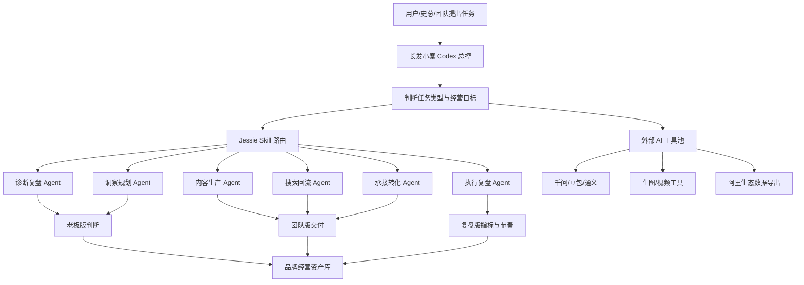

# 长发小寨专属 Codex 蓝图

## 一句话判断

可以做，而且不应该只做一个「悟空套皮」。长发小寨更适合做一个电商经营型 Codex：用 Codex 做总控，用 Jessie Skill 做业务 SOP，用表格模板做数据交付，用外部 AI 工具做专用生成能力。

## 悟空给我们的启发

公开资料显示，悟空的核心不是单个聊天模型，而是企业任务的多 Agent 协作平台。它的价值点大概率在三件事：

1. 把任务拆给不同 Agent。
2. 连接企业工具和业务数据。
3. 把文档、调研、会议、执行结果沉淀为可复用资产。

这对长发小寨的启发是：我们的目标不是复制一个聊天框，而是建立「AI 经营中枢」。

进一步说，悟空更应被定位为淘宝/天猫专项 Agent。它是阿里生态产物，天然更靠近淘内搜索、店铺承接、投放和成交。长发小寨不能把总控权交给任何单一平台 Agent，因为品牌经营还包含小红书、抖音、微信私域、包装设计、供应链、内容资产和品牌资产。

长发小寨 Codex 的核心价值，是未来可以调配很多个“悟空式 Agent”：淘宝用悟空，小红书用小红书 Agent，抖音用视频/直播 Agent，包装用供应链 Agent，数据用 BI Agent，最终由 Codex 做统一判断和资产沉淀。

## 当前资产判断

项目里的 Jessie 35 个 Skill 已经覆盖完整链路：

- AI语义资产：品牌语义、商品语义、AI可引用内容、AI推荐内收、信任证据链。
- 诊断复盘：品牌全域内容流量诊断、618/大促后内容资产复盘。
- 洞察规划：内容流量地图、竞品同行趋势、高价值人群、趋势赛道、内容机会池。
- 内容链路：内容搜索承接连接、断链检查、W+I->N、内容蓄水。
- 内容生产：短视频脚本、小红书笔记、内容表达标准。
- 搜索回流：三类关键词、U型回流、搜索回流观察、优质素材筛选、内容投放协同。
- 承接转化：外种内收、店铺承接优化、内容到承接检查。
- 执行复盘：经营判断、三角色分工、负责人推进、私域内容、7天行动、甘特图、60天陪跑。

这些不是散装提示词，已经接近一个可被调度的经营操作系统。

## 推荐架构

## 已完成的第一版落地

- 已把 35 个 Jessie Skill 解包到 `jessie-skills/`。
- 已生成 Skill 清单：`jessie-skills/_skill_manifest.md`。
- 已创建总控 Skill 草案：`skills/changfa-xiaozhai-codex/`。
- 已写入总控路由表：`skills/changfa-xiaozhai-codex/references/skill-routing.md`。
- 已写入外部 AI 调度原则：`skills/changfa-xiaozhai-codex/references/external-ai-routing.md`。

## 下一步建议

1. 先跑一个真实任务：比如「基于史总汇报，诊断长发小寨当前 AI 电商经营主断点」。
2. 把长发小寨自己的品牌资料、SKU、平台、内容样本、投放表、店铺截图放进项目资产库。
3. 把常用输出做成固定模板：老板汇报、团队行动表、7天计划、60天甘特图、复盘看板。
4. 等总控 Skill 跑顺后，再安装到 Codex 全局 Skills，让它可被自动触发。
